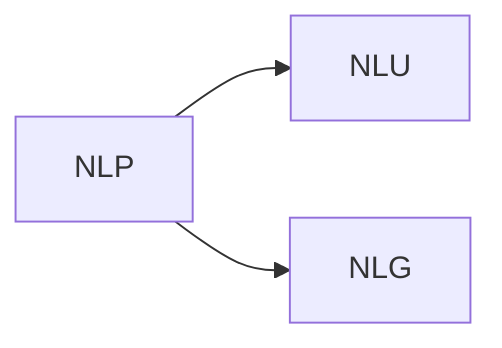

# 오늘은...

이스트소프트는 얼굴을 생성하고 대본으로부터 목소리를 생성하여 템플릿 동영상에서 얼굴만 대체하는 방식으로 ai 앵커를 만들었다.

# 변형진 ESTsoft Tech 센터장 Deep Learning Language Models

LLM 기본 원리 이해하고 gpt를 직접 사용해보기로 한다.

키오스크 안에서 동작하는 GPT 연동 AI 휴먼을 만들어봤다.

- NLU
	- Natural Language Understanding
	- Text → Meaning
- NLG
	- Natural Language Generation
	- Meaning → Text

Sentiment (감정)을 판단할 수도 있음. Supervised learning을 통해 학습함.
