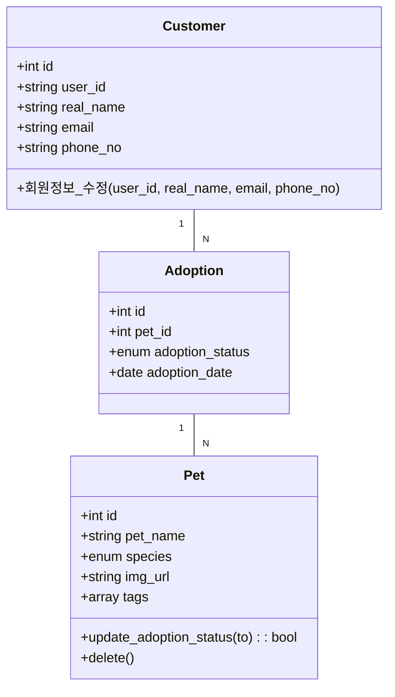

[[Technical_Documentation.pdf]]

# 기술문서? 종류, 필요성

우리가 볼 수 있는 기술문서의 종류

- 논문
- 공식문서
- 논문
- 사용설명서
- 
- 

**왜 필요한가**

> 아무리 좋은 기술력을 가지고 있다고 하더라도 그 기술을 **전파**할 수 없다면 효용성이 없다.

논문같은 경우는 지식의 확장을 이뤄내는 일이기 때문에 학계에서 집단지성을 공개하는 일종의 장이다. 논문은 발표된 자료에 기반해 새로운 지식을 창조하는 판을 제공한다.

재현가능성(Reproductibility)를 향상시켜 소모적인 일에 시간을 투자하는 일을 줄일 수 있다.

## 사전과제 이야기

> 여러분의 집에서 주변 번화가까지 가는 방법을 서술하세요.

인터넷이 안되는 상황 속에서 오로지 문서만 가지고 찾아갈 수 있는가 여부를 위주로 평가

[[20230803 estsoft 기술문서 작성법 특강 사전과제 풀이 {계성혁}]]

## 기술문서의 특징

- **구조적** : 6하원칙, 체계적인 목차
	- 검색이 잘 되어야 한다. 인덱싱도 그렇고.
- **통일성** : 용어정의 통일, 템플릿
	- 라운지에서 이야기하는 채널과 일대일로 이야기할 수 있는 DM은 서로 다르다. 이런 용어에 대한 혼선을 빚지 않도록 용어 자체도 정의를 한 다음에 용어가 동일한 의미로 사용되는지 재고하여야 한다. 동일한 형태의 문서라면 동일한 템플릿 / 서식
- **간결성**: 명확한 제목, 객관적인 표현

황우석 박사의 논문조작사건이 주는 파장: 내용이 진실되지 않는것이 주는 파급력은 굉장히 크다. 그 지식을 기반으로 쌓아온 새로운 지식들도 같이 무너지기 때문.

# SW 개발과 기술문서

sw 개발과 건물 올리는 과정

> 소프트웨어 출시 후 발견된 요구사항 오류는 그 수정 비용이 매우 높지만, 초기에 발견된다면 그 비용이 매우 낮아집니다

어떻게 하면 그 비용을 최소화 할 수 있을까?

## 개발 방법론 (Framework)

[[애자일 101.pdf]]  
[[20230508 estsoft - 김충환 회고강사특강 - 애자일 회고 - 매슬로우의 욕구계층 - 만다라트 과제있음]]

- build and fix model
	- 일단 만들고 고쳐
	- 다 만든 뒤에 피드백을 보기 때문에 수정에 비용이 매우 커진다.
- waterfall model
	- SRS, 디자인, 개발, 테스팅 ... 과정을 한 단계씩 진행한다.
	- 그런데 빠꾸가 없음. 중간단계에서 요구사항이 바뀌던가 설계를 잘못했던가 하면 다시 맨 처음으로 돌아가야만 한다.
- iteration model(Agile Framework)
	- SW를 동작이 가능한 최소단위로 쪼개 점진적으로 완성시킨다.

**공통점**

일반적인 언어 (비기술적인 언어)로 소프트웨어가 어떤 모습이 되어야 하는지 기술하는 것도 중요하다. 대표적으로 구현현황에 대한 자료를 포함한다.

- 깃허브 리드미 파일
- openapi, swagger ui
	- API들의 리스트들과 API 하나하나가 정의하는 스키마
- 다이어그램

# SRS (Software Requiremenet Specification)

소프트웨어 요구사항을 정리한 문서

- 기능적 요구사항
- 외부 인터페이스 (API, SDK)
- 비기능적 요구사항
	- 성능
	- 안정성
	- 보안
	- 유지보수성
- 제약사항

**SRS 작성 원칙**

~~사실 모든 기술문서가 다 그렇지~~

- 모두가 동의하여야 하고 
- 명료하여야 하고
- 모든 요구사항들이 담겨야 하고
	- 중간중간에 계속 들어오는 걸 막을 수는 없음.
- 내용들은 모두 일관적이어야 한다.
- 중요도나 안정성에 따라 순위가 매겨져 있어야 한다.
- 검증할 수 있어야 한다.
- 수정할 수 있어야 한다.
- 추적 가능해야 한다.

**Glossary**

단어집이 필요한 이유: 비기술자도 읽고 이해할 수 있어야 함. 기존의 익숙한 개념으로 사용하거나 새로운 단어를 정의하기도 하는 등 문서 안에서 일반적으로 사용될 수 있다.

비기술적인 용어로 기술된다. 탑다운 방식으로 요구사항이 구체화되는듯.

## Diagrams

말로 다 설명하기 어려운 부분들을 예시 SRS를 보면 다이어그램을 통해 시각적으로 보여주고 있음을 보여주고 있다. 다이어그램은

- 다양한 이해당사자들이 명확하게 소통할 수 있는 수단이 되어야 하고
- 특정 기술에 종속되지 않아야 하며
- 문제를 해결하기 위한 방안을 제공해야 한다.

대중적으로는 UML 다이어그램을 많이 사용한다. 구성 요소로는 여러 개체가 서로 관계를 시각적으로 표현하는 데에 있다. 

구조를 표현할 수도 있고, 행위를 표현할 수도 있다.

### Use Case Diagram

행위자가 요구하여 시스템이 수행하는 일의 목표 (추상화됨)

- 행위자 (Actor)
- 유스케이스
- 관계 (Association): 액터가 요구할 수 있는 유스케이스, 일반화 관계, include/extend 관계 모두를 포함함
- 시스템 경계

**실습**

[[Technical_Documentation_Usecase_Diagram.excalidraw]]  
![[Technical_Documentation_Usecase_Diagram.excalidraw.png]]

### Class Diagram

관련있는 **데이터**와 **행위**를 한데 묶어 구조화한 결과를 표현

**실습**

### Sequence Diagram

행위를 보여주는거임. 내부구성요소간의 상호작용 순서를 나타내는 도표

# 도구를 이용한 문서 자동화

다양한 문서 혹은 다이어그램들을 작성했지만 작성해야 할 문서는 더욱 많다.

- api specification
- ERD
- SDK 문서
- 
- 
- 

우리는 게으른 민족이다. 언제 다 수작업으로 만드냐? 생각보다 자동화 도구는 굉장히 많다. 다이어그램 뽑아주는거랑, 자동으로 API 문서 만들어주는거 등등

## sphinx 를 활용한 코드 문서화

## swagger-ui 자동생성기 `drf-yasg`

[doc](https://drf-yasg.readthedocs.io/en/stable/)
