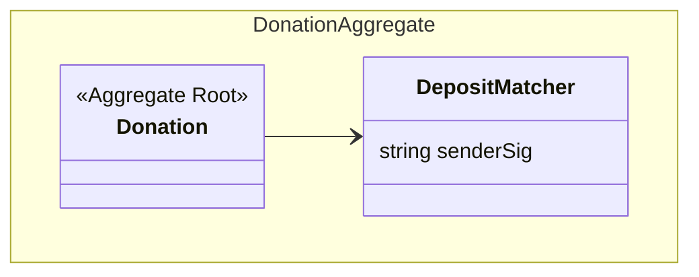

그럼 무엇을 해야하나? 거대한 PR을 요약하기, Donation 관련하여 두가지 설계 방향으로 구현한 브랜치를 비교분석, JIRA 티켓 보면서 완료한 것, 해야할 것 브리핑. 작성한 문서, 작성해야 할 문서.

## 브랜치 요약

한 번에 git diff GPT가 요약을 못한다 (3000줄에 육박). 그러므로 엔티티는 엔티티대로, spec은 spec 대로, 이벤트는 이벤트대로 따로따로 요약을 하여 PR 메시지를 작성해야 한다.

## Donation 두가지 설계방향

`ProvisionalDonation` 기존의 설계방향에 문제가 있는 것 같다. `Donation` 엔티티와 분리한 이유는 처음엔 Donation을 건들이지 않고 안전한 곳에서 작업하기 위해서였고, 나중엔 `senderSig`와 같이 이체와 더 관련이 있는 정보가 `Donation`으로부터 격리하기 위해서 그렇게 한 것이었다. 그 결과로 실제 입금이 성사되기 전까지 임시 엔티티를 만들어놓은 뒤에 입금이 성사된 후원들만 깔끔하게 `Donation`에 쌓이길 기대했다.

그런데 **중복**이 발견되었다. 두 Status를 확인해보자:

```typescript
export enum DonationStatus {
  Donated = 'Donated', // 후원한 상태
  WaitingRefund = 'WaitingRefund', // 환불 대기중
  RefundComplete = 'RefundComplete', // 환불 완료
  Deleted = 'Deleted', // 삭제 완료
}

export enum ProvisionalDonationStatus {
  Pending = 'Pending',
  Approved = 'Approved',
  Rejected = 'Rejected',
  Refunded = 'Refunded',
}
```

`ProvisionalDonation`은 입금 이후에는 관심이 없어야 한다. 왜 Refund가 있는건데? 생각해보면 후원 성사 이후 후원 취소로 인한 환불로직에 대해서 일관성을 유지하려면 두개의 엔티티를 동시에 다루어야 한다는 문제가 생긴다. 그리고 `Donation` 엔티티에 "미결제" 상태와 "sender signature" 프로퍼티 이렇게만 추가하면 필터링 로직이 복잡해지지 않으면서도 모든 상태를 추적할 수 있다는 것이 장점이 된다.

그리고 `Donation` 자체를 Aggregate Root 로 쓰는 방법을 고안해 볼 수 있게된다. `ProvisionalDonation`은 이체내역과의 매칭에 관해서만 책임지고 바깥으로는 노출시키지 않는 것이다. 그렇다면 아예 이름을 `DepositMatcher`라고 지을 수도 있겠다.


