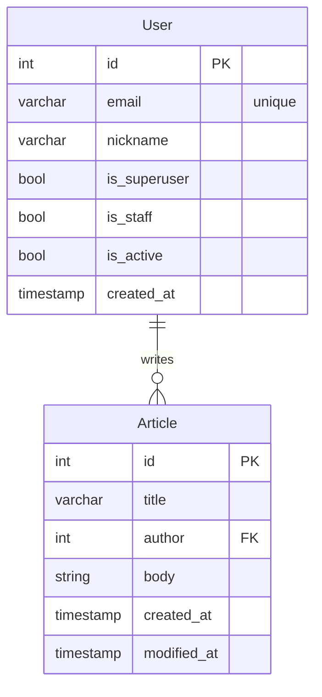

parent link: [[0014.1 Django 🎈]]

[requirements {Notion}](https://paullabworkspace.notion.site/Blog-2a7d87f563ad42f9a0382f523fae14e1)

# Requirements

- [base repo](https://github.com/weniv/BackendOrmi/tree/main/HTML-CSS/board_final)를 기본으로 커스텀 하여 만들것
- \[option\]  [react-blog](https://weniv.github.io/react-blog/) 를 커스텀하여 프론트를 퀄리티 있게 만들것
- 클래스형 뷰를 사용하여 개발할 것
- drf를 사용하지 말고 monolithic web app을 만들것
- [dbdiagram](https://dbdiagram.io/home)을 사용하여 데이터베이스 구조를 설계할 것
	- [[Customizing authentication in {django} {AbstractUser, AbstractBaseUser}]]

## 0. Django Admin을 이용한 게시글 읽기 및 메인 페이지 구현

이거는 블로그 튜토리얼에서 했던 [[tinymce]] 비스무리한 텍스트 에디터 플러그인을 끌어와 쓰면 된다. 음화화

Django Admin을 이용하여 게시글을 생성하고, 메인 페이지에서 게시글 목록을 볼 수 있도록 구현합니다.

쉽게 말해, 블로그 게시글을 Create하는 기능을 django로 작성하지 않고 Admin을 이용하여 게시글을 작성합니다. 즉, 게시글들과 게시글의 상세 페이지를 “보여주는”기능만 완성하면 됩니다.

- URL : `/` 
	- 페이지 제목과 블로그 입장하기 버튼이 있습니다.
	- `index.html` 내용을 수정하여 `/blog` 엔드포인트로 보내야겠군
- Django admin을 이용하여 게시글 작성
	- 게시글은 제목, 내용으로 구성되어 있습니다.
	- `/admin` 을 이용하여 게시글을 작성해보세요.  
	- [[tinymce]]를 이용하여 Admin 페이지에 추가 어떻게 하더라?
	- DEPENDS ON 데이터 모델링
- 작성되어 있는 게시글 목록을 볼 수 있습니다.  
	- URL : `/blog`
	- 게시글들의 제목을 확인 할 수 있습니다.  
- 작성 되어있는 게시글 상세 페이지를 볼 수 있습니다.  
	- URL : `/blog/<int:id>`
	- ex) `/blog/1, /blog/2,...`
	- 게시글의 제목/내용을 보는 기능입니다.

## 1. 블로그 CRUD 기능 구현하기

- ~~main page~~
- 게시글 작성 기능
	- `url`: `/blog/write/`
	- 게시글 제목과 내용을 작성할 수 있는 페이지
	- 작성한 게시글이 저장되어 게시글 목록에 보여야 함.
	- **카테고리**가 지정

	> [!note]  
	>  로그인이 되지 않더라도 글 작성이 가능하게끔

- ~~list view~~
- ~~detail view~~
- 게시글 수정 기능
	- `url`: `/blog/edit/<int:id>/`
	- 게시글 제목과 내용을 수정하는 페이지
	- 수정한 내용은 게시글 목록보기 / 상세보기에 반영
- 게시글 삭제 기능
	- `url`: `/blog/delete/<int:id>/`
	- 게시글 삭제 완료 이후 list view로 redirect
	- 삭제된 게시글은 list, detail 접근 불가능하며, 접근시도시 404 발생
- 게시글 검색 기능
	- `url`: `/blog/search/<str:tag>`
	- 카테고리, 주제에 따라 검색이 가능하게
	- 검색한 게시물은 시간순에 따라 정렬
