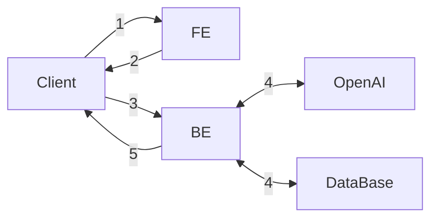
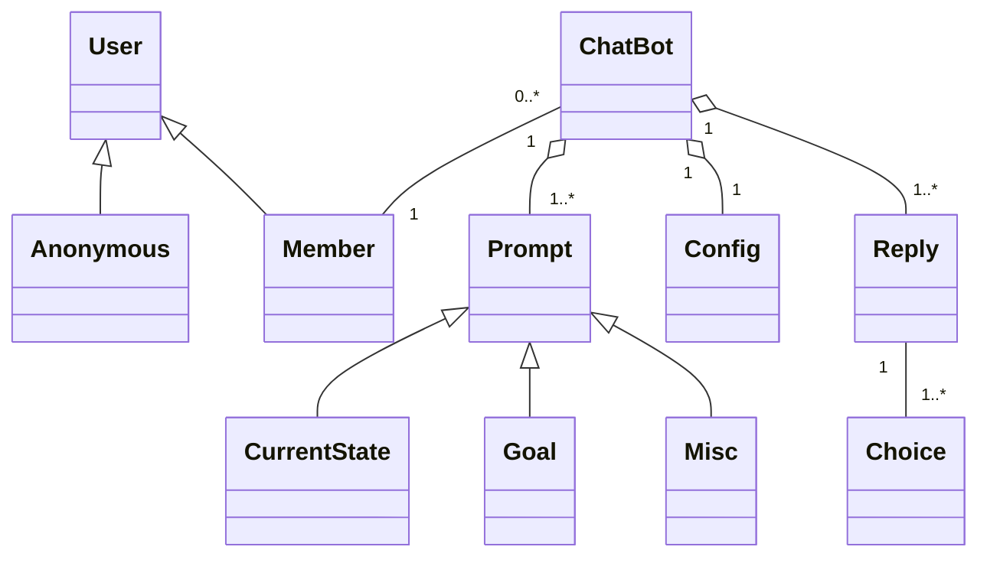

- parent link: [[0014.1 Django 🎈]], [[0012.1 ESTsoft 백엔드 개발자 부트캠프 오르미 1기 🙊]]
- [요구사항 {Notion}](https://paullabworkspace.notion.site/ChatGPT-1bc750970cef40519e42a9d74404b5cb)
- [ormi-project-1 {Notion}](https://github.com/ChoiWheatley/ormi-project-1)
- [ormi-project-3 {Github}](git@github.com:ChoiWheatley/ormi-project-3.git)
- [[DRF에서 인가기능 만들기 {drf}]]
- [[DRF에서 인증기능 만들기 {drf}]]

## 기본 요구사항

- 모든 구현은 **DRF** 를 이용하여 구현.
- 클래스 기반 뷰 사용
- 회원가입 / 로그인
- 채팅은 로그인을 한 유저만 사용 가능함
- 유저당 하루 최대 5번 요청가능
- 채팅내역을 DB에 저장
- 저장된 __본인의__ 채팅 내역을 조회할 수 있고,
- ~~모든 채팅내역은 로그인하지 않은 유저들에게도 열람권한이 있다.~~
- ERD를 그려주세요.

## 선택 요구사항

- FE 배포 (Github Page를 사용하여 별개의 프로젝트로)
- BE 배포
- HTTPS 추가
- kakao, github 등 OAuth2 추가하기

## Diagrams

기본 요구사항: FE와 BE 분리: 프론트엔드에서 백엔드 서버를 통해 요청을 보내준다.

### Flowchart



1. 클라이언트가 프론트에 HTML 문서를 요청함.
2. 프론트는 JS코드가 담긴 HTML 문서를 반환하고 클라이언트는 문서를 렌더링함.
3. 클라이언트는 백엔드에게 다음과 같은 요청들을 보낸다.
	1. 회원가입, 로그인, 로그아웃과 같은 사용자 인증/인가
	2. 모든 유저의 채팅내역
	3. 본인의 채팅내역
	4. 챗봇과의 채팅세션
4. 백엔드는 클라이언트의 요청에 따라서 두 가지 서비스에 요청을 보낸다. 유스케이스 그래프는 따로
	1. DB
	2. OpenAI
5. 백엔드가 각각의 서비스로부터 응답을 받으면 이를 통해 클라이언트에게 응답을 전송함.

### Usecase Diagram

[[chatgpt-usecase.excalidraw]]  
![[chatgpt-usecase.excalidraw.png]]

#### Main Flow

- _User_
	- Request Chat List
		- _System_
			- Retrieve chat data.
			- Create DOM elements for display
	- Request Chat Session
		- _System_
			- Check if the user is logged in. If not logged in, invoke **E-1**
			- Create Request Prompts
				- _ChatBot_
					- Ask user's current state
					- Ask user's goal
					- Ask user's other requirements
			- Request _OpenAI_ with previous prompts
	- Sign out

#### Error Flow, E-1

- _System_
	- redirect to login page
	- if URL has `?next=` phrase, redirect to the provided page
	- if not, redirect to main page

### Class Diagram



ChatBot은 데이터이다. 새 세션을 생성하거나 세션목록을 요청할 때 흩어져 있는 정보를 모아 실제 GPT와 대화가 이루어진 요청과 응답을 고스란히 재현하여야 한다. ChatBot은 컨트롤러이다. 따라서 이름이 적합하지는 않은 것 같다. 클래스 다이어그램에 들어갈 필요도 없을 것이고.

### ER Diagram

- [openai api documentation](https://platform.openai.com/docs/api-reference/making-requests)

[[JSON을 정형 데이터베이스에 저장하는법 {question}]]

**example request**

```shell
curl https://api.openai.com/v1/chat/completions \
  -H "Content-Type: application/json" \
  -H "Authorization: Bearer $OPENAI_API_KEY" \
  -d '{
    "model": "gpt-3.5-turbo",
    "messages": [
      {
        "role": "system",
        "content": "You are a helpful assistant."
      },
      {
        "role": "user",
        "content": "Hello!"
      }
    ]
  }'
```

**example response**

```json
{
  "id": "chatcmpl-123",
  "object": "chat.completion",
  "created": 1677652288,
  "choices": [{
    "index": 0,
    "message": {
      "role": "assistant",
      "content": "\n\nHello there, how may I assist you today?",
    },
    "finish_reason": "stop"
  }],
  "usage": {
    "prompt_tokens": 9,
    "completion_tokens": 12,
    "total_tokens": 21
  }
}
```

#### 1차: 높은 확장성

[[3차 프로젝트, ER-Diagram {1차시도}]]

#### 2차: 정형 스키마 치환

- `ChatBotConfig`의 컬럼을 구체적으로 작성
- `ChatBotReply`의 컬럼을 구체적으로 작성, 일대일 구조인 `usage`는 같은 테이블로 편입, 일대다 구조인 `choices`는 별개의 테이블로 뺐음.


## Usecase & Component Layer

- [?] [[프론트엔드에서의 form과 백엔드에서의 form fields는 독립적이어야 하나 {drf, django}]]


[[usecase_component_diagram.excalidraw]]  
![[usecase_component_diagram.excalidraw.png]]

## Django + React Full Course

[[Django + React Full Cource Youtube Playlist]] 로 가세요

## 구현 - 토큰으로 사용자 인증/인가 수행

DRF는 Stateless 원칙을 지키기 위해 Token based Authentication을 제공한다. (물론 세션방식도 있긴 함) 나는 `is_authenticated`만 만족시키면 되기 때문에 뭐 특별히 커스텀 권한을 만들 필요는 없다. 하지만 아직까지 JWT를 사용하여 요청의 유저를 식별하는 방법에 대해서 잘 알지 못하겠다.

우선 [[DRF에서 인증기능 만들기 {drf}]]에서 공부한 simple jwt 문서를 더 읽어보는 것으로 출발하자.

[[Simple JWT package {drf}{rest_framework_simplejwt}]]

이제 장고에서 로그인을 처리하는 로직은 끝난 것 같다. stateless를 구현하기도 했겠다, 나는 들어오는 요청들에 대하여 `JWTAuthentication().authenticate(request)`만을 수행하여 그 결과를 가지고 바로 쿼리를 진행하면 되기 때문이다. 그러면 access token, refresh token은 누가 책임지냐고? 그거야 프론트가 알아서 하겠지 😏
