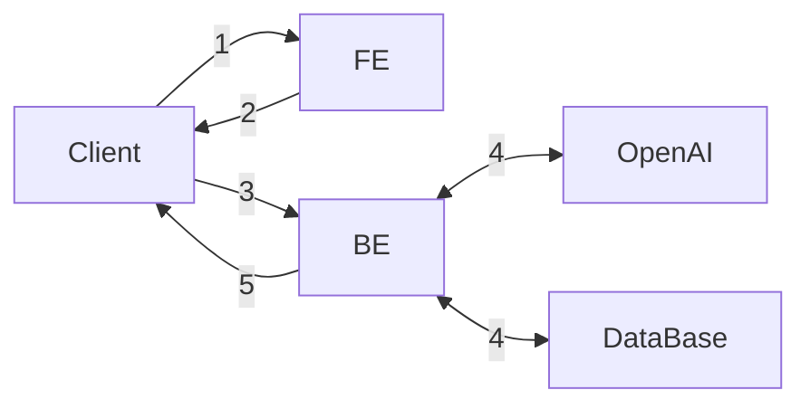
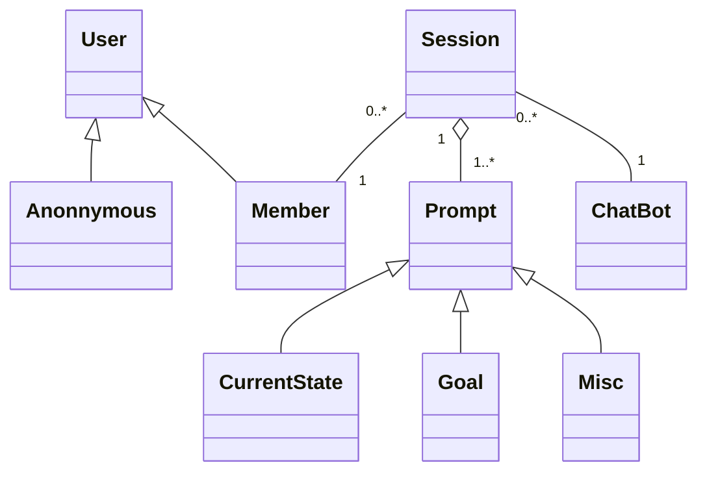
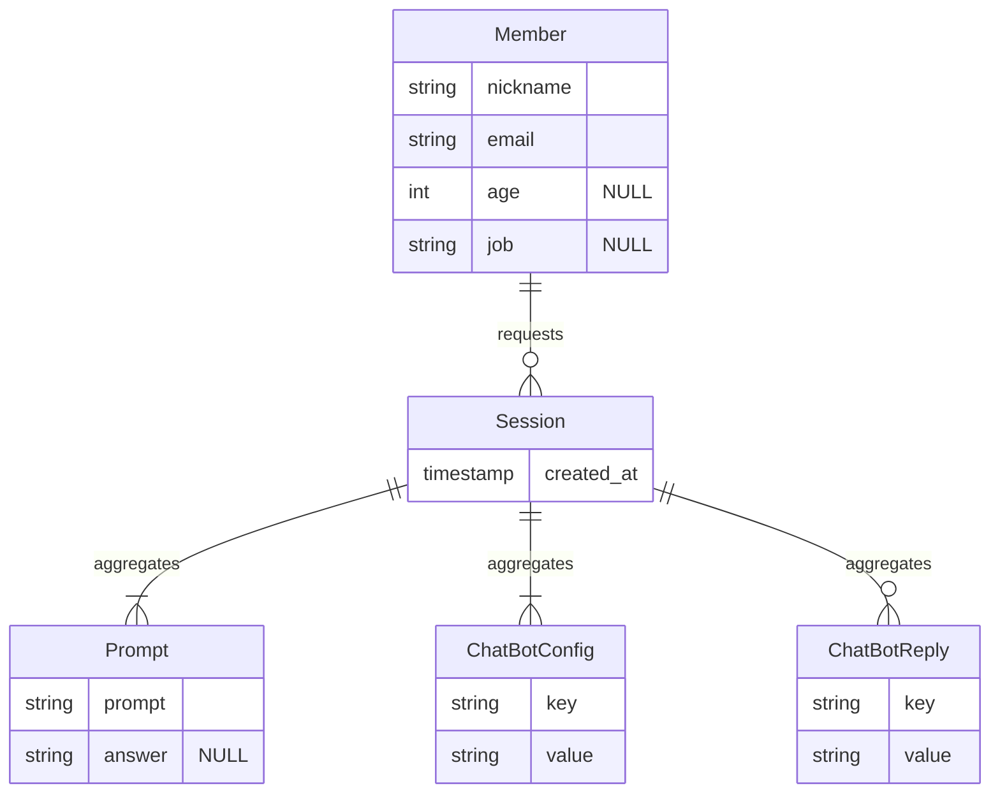
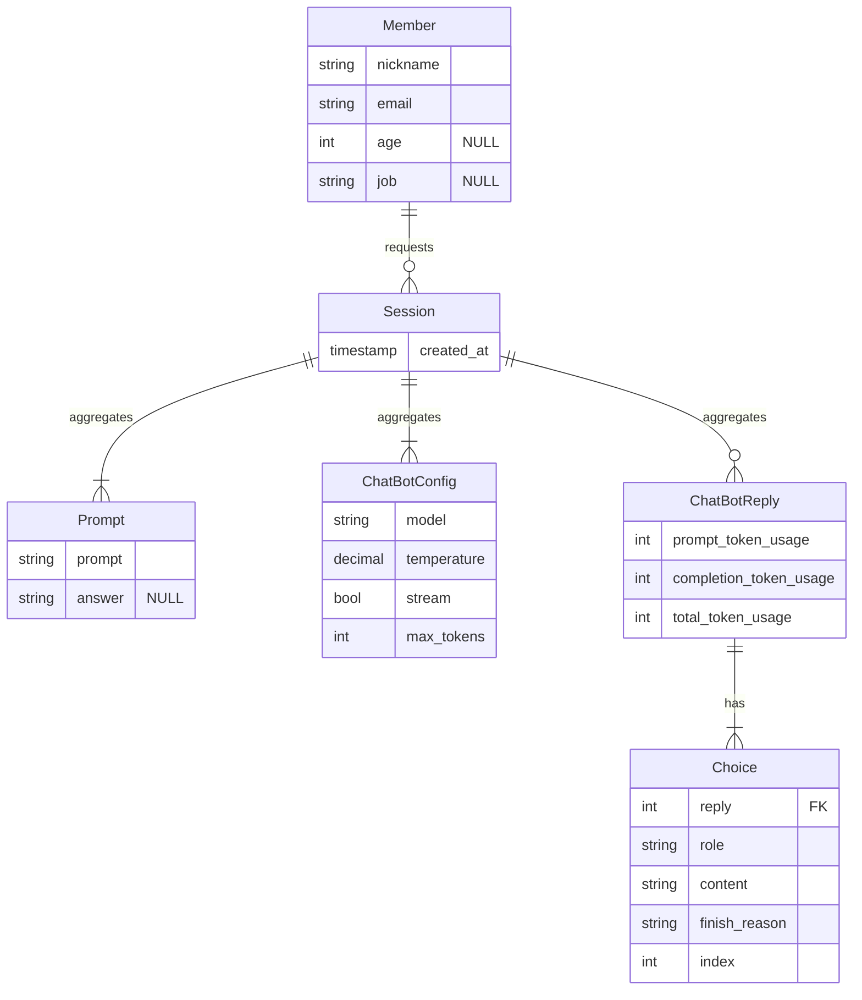

- parent link: [[0014.1 Django 🎈]], [[0012.1 ESTsoft 백엔드 개발자 부트캠프 오르미 1기 🙊]]
- [요구사항 {Notion}](https://paullabworkspace.notion.site/ChatGPT-1bc750970cef40519e42a9d74404b5cb)
- [ormi-project-1 {Notion}](https://github.com/ChoiWheatley/ormi-project-1)

## 기본 요구사항

- 모든 구현은 **DRF** 를 이용하여 구현.
- 클래스 기반 뷰 사용
- 회원가입 / 로그인
- 채팅은 로그인을 한 유저만 사용 가능함
- 유저당 하루 최대 5번 요청가능
- 채팅내역을 DB에 저장
- 저장된 __본인의__ 채팅 내역을 조회할 수 있고,
- ~~모든 채팅내역은 로그인하지 않은 유저들에게도 열람권한이 있다.~~
- ERD를 그려주세요.

## 선택 요구사항

- FE 배포 (Github Page를 사용하여 별개의 프로젝트로)
- BE 배포
- HTTPS 추가
- kakao, github 등 OAuth2 추가하기

## Diagrams

기본 요구사항: FE와 BE 분리: 프론트엔드에서 백엔드 서버를 통해 요청을 보내준다.

### Flowchart



1. 클라이언트가 프론트에 HTML 문서를 요청함.
2. 프론트는 JS코드가 담긴 HTML 문서를 반환하고 클라이언트는 문서를 렌더링함.
3. 클라이언트는 백엔드에게 다음과 같은 요청들을 보낸다.
	1. 회원가입, 로그인, 로그아웃과 같은 사용자 인증/인가
	2. 모든 유저의 채팅내역
	3. 본인의 채팅내역
	4. 챗봇과의 채팅세션
4. 백엔드는 클라이언트의 요청에 따라서 두 가지 서비스에 요청을 보낸다. 유스케이스 그래프는 따로
	1. DB
	2. OpenAI
5. 백엔드가 각각의 서비스로부터 응답을 받으면 이를 통해 클라이언트에게 응답을 전송함.

### Usecase Diagram

![[chatgpt-usecase.excalidraw|800]]  

![[chatgpt-usecase.excalidraw.png]]

#### Main Flow

- _User_
	- Request Chat List
		- _System_
			- Retrieve chat data.
			- Create DOM elements for display
	- Request Chat Session
		- _System_
			- Check if the user is logged in. If not logged in, invoke **E-1**
			- Create Request Prompts
				- _ChatBot_
					- Ask user's current state
					- Ask user's goal
					- Ask user's other requirements
			- Request _OpenAI_ with previous prompts
	- Sign out

#### Error Flow, E-1

- _System_
	- redirect to login page
	- if URL has `?next=` phrase, redirect to the provided page
	- if not, redirect to main page

### Class Diagram



### ER Diagram

- [openai api documentation](https://platform.openai.com/docs/api-reference/making-requests)

#### 1차: 높은 확장성

openai request, response는 JSON 형식을 갖고있고, JSON은 반정형 데이터이기 때문에 정형 데이터를 저장하는 SQL에 있어서 커다란 장애물이 된다. 이 문제를 해소하고 확장성을 높이기 위해 WordPress의 스타일을 차용하였다. `key`, `value` 쌍을 저장하는 것이다. 쿼리 속도는 늦어질지 몰라도 적어도 1단계 깊이의 객체를 표현할 수 있다. 

`ChatBotconfig`는 request에서 필요한 데이터들을 저장한다. 아래 example request을 보면 `"model"` 이 그 예이다. [Create chat completion](https://platform.openai.com/docs/api-reference/chat/create) 쪽을 보면 필요한 key, value 쌍에 무엇이 필요한지 알 수 있다.

- **`model`**: chat gpt의 모델
- **`messages`**: 세션 안에서 GPT와 대화한 내역을 모두 저장하여야 한다. 아래는 배열 안에 들어간다.
	- **`role`** : `system`, `user`, `assistant`, `function` 중 하나를 가진다.
	- **`content`**: 메시지의 내용. 함수호출일 경우 비어있을 수도 있다.
- **`functions`**: JSON을 인자로 넣는 함수의 리스트를 정의 ~~근데 잘 모르겠다~~
	- **`name`**: 호출할 함수 이름
	- **`parameters`**: 인자, JSON 형식
- **`stream`**: True일 경우 부분 메시지가 함께 보내진다. 실시간으로 응답이 들어오기 때문에 유저가 지루하지 않다는 장점이 있다.

나는 OpenAI의 Response만 어떻게 잘 처리하면 된다. request를 JSON으로 만드는 것은 데이터베이스의 문제가 아니기 때문이다. 

[[JSON을 정형 데이터베이스에 저장하는법 {question}]]

**example request**

```shell
curl https://api.openai.com/v1/chat/completions \
  -H "Content-Type: application/json" \
  -H "Authorization: Bearer $OPENAI_API_KEY" \
  -d '{
    "model": "gpt-3.5-turbo",
    "messages": [
      {
        "role": "system",
        "content": "You are a helpful assistant."
      },
      {
        "role": "user",
        "content": "Hello!"
      }
    ]
  }'
```

**example response**

```json
{
  "id": "chatcmpl-123",
  "object": "chat.completion",
  "created": 1677652288,
  "choices": [{
    "index": 0,
    "message": {
      "role": "assistant",
      "content": "\n\nHello there, how may I assist you today?",
    },
    "finish_reason": "stop"
  }],
  "usage": {
    "prompt_tokens": 9,
    "completion_tokens": 12,
    "total_tokens": 21
  }
}
```

`ChatBotReply`에게 필요한 건 확장성인가, `message.text`만 있으면 되는가.



멘토님께 질문하고 나니 굳이 이렇게 key, value를 사용할 필요는 없어보인다. JSON을 형식 그대로 저장하고 싶다면 MongoDB를 써도 되지만 나는 단순한 스키마를 채택하는 것이 정신건강에 이로울 것 같다. openai의 API 응답을 그대로 재현할 필요는 없지 않을까?

#### 2차: 스키마 고정

**수정사항**: 

- `ChatBotConfig`의 컬럼을 구체적으로 작성
- `ChatBotReply`의 컬럼을 구체적으로 작성, 일대일 구조인 `usage`는 같은 테이블로 편입, 일대다 구조인 `choices`는 별개의 테이블로 뺐음.



## Usecase & Component Layer

- [?] [[프론트엔드에서의 form과 백엔드에서의 form fields는 독립적이어야 하나 {drf, django}]]


![[usecase_component_diagram.excalidraw|800]]

![[usecase_component_diagram.excalidraw.png]]

## Django + React Full Course

[[Django + React Full Cource Youtube Playlist]] 로 가세요
