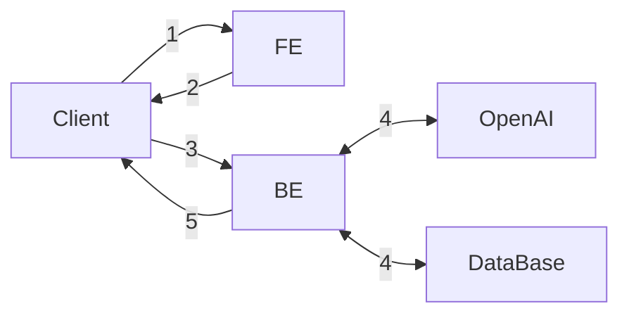
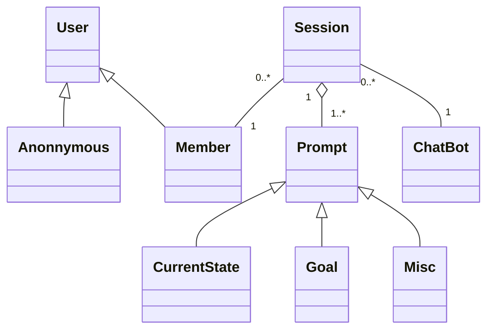

- parent link: [[0014.1 Django 🎈]], [[0012.1 ESTsoft 백엔드 개발자 부트캠프 오르미 1기 🙊]]
- [요구사항 {Notion}](https://paullabworkspace.notion.site/ChatGPT-1bc750970cef40519e42a9d74404b5cb)
- [ormi-project-1 {Notion}](https://github.com/ChoiWheatley/ormi-project-1)

## 기본 요구사항

- 모든 구현은 **DRF** 를 이용하여 구현.
- 클래스 기반 뷰 사용
- 회원가입 / 로그인
- 채팅은 로그인을 한 유저만 사용 가능함
- 유저당 하루 최대 5번 요청가능
- 채팅내역을 DB에 저장
- 저장된 채팅 내역을 조회할 수 있고,
- 모든 채팅내역은 로그인하지 않은 유저들에게도 열람권한이 있다.
- ERD를 그려주세요.

## 선택 요구사항

- FE 배포 (Github Page를 사용하여 별개의 프로젝트로)
- BE 배포
- HTTPS 추가
- kakao, github 등 OAuth2 추가하기

## Diagrams

기본 요구사항: FE와 BE 분리: 프론트엔드에서 백엔드 서버를 통해 요청을 보내준다.

### Flowchart



1. 클라이언트가 프론트에 HTML 문서를 요청함.
2. 프론트는 JS코드가 담긴 HTML 문서를 반환하고 클라이언트는 문서를 렌더링함.
3. 클라이언트는 백엔드에게 다음과 같은 요청들을 보낸다.
	1. 회원가입, 로그인, 로그아웃과 같은 사용자 인증/인가
	2. 모든 유저의 채팅내역
	3. 본인의 채팅내역
	4. 챗봇과의 채팅세션
4. 백엔드는 클라이언트의 요청에 따라서 두 가지 서비스에 요청을 보낸다. 유스케이스 그래프는 따로
	1. DB
	2. OpenAI
5. 백엔드가 각각의 서비스로부터 응답을 받으면 이를 통해 클라이언트에게 응답을 전송함.

### Usecase Diagram

![[chatgpt-usecase.excalidraw]]  
![[chatgpt-usecase.excalidraw.png]]

#### Main Flow

- _User_
	- Request Chat List
		- _System_
			- Retrieve chat data.
			- Create DOM elements for display
	- Request Chat Session
		- _System_
			- Check if the user is logged in. If not logged in, invoke **E-1**
			- Create Request Prompts
				- _ChatBot_
					- Ask user's current state
					- Ask user's goal
					- Ask user's other requirements
			- Request _OpenAI_ with previous prompts
	- Sign out

#### Error Flow, E-1

- _System_
	- redirect to login page
	- if URL has `?next=` phrase, redirect to the provided page
	- if not, redirect to main page

### Class Diagram



### ER Diagram

```mermaid
erDiagram
	Member ||--o{ Session : requests
	Session ||--|{ Prompt : 
```
