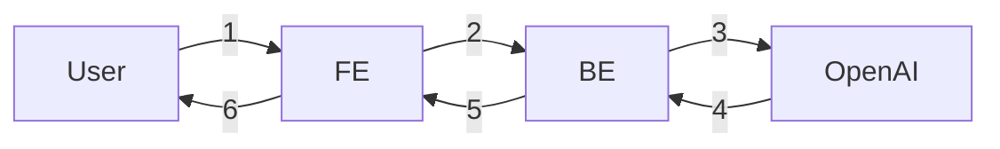

- [요구사항 {Notion}](https://paullabworkspace.notion.site/ChatGPT-1bc750970cef40519e42a9d74404b5cb)
- [ormi-project-1 {Notion}](https://github.com/ChoiWheatley/ormi-project-1)

## 기본 요구사항

- 모든 구현은 **DRF** 를 이용하여 구현.
- 클래스 기반 뷰 사용
- 회원가입 / 로그인
- 채팅은 로그인을 한 유저만 사용 가능함
- 유저당 하루 최대 5번 요청가능
- 채팅내역을 DB에 저장
- 저장된 채팅 내역을 조회할 수 있고,
- 모든 채팅내역은 로그인하지 않은 유저들에게도 열람권한이 있다.

## 선택 요구사항

- FE 배포 (Github Page를 사용하여 별개의 프로젝트로)
- BE 배포
- HTTPS 추가
- kakao, github 등 OAuth2 추가하기

## Diagram

기본 요구사항: FE와 BE 분리: 프론트엔드에서 백엔드 서버를 통해 요청을 보내준다.

