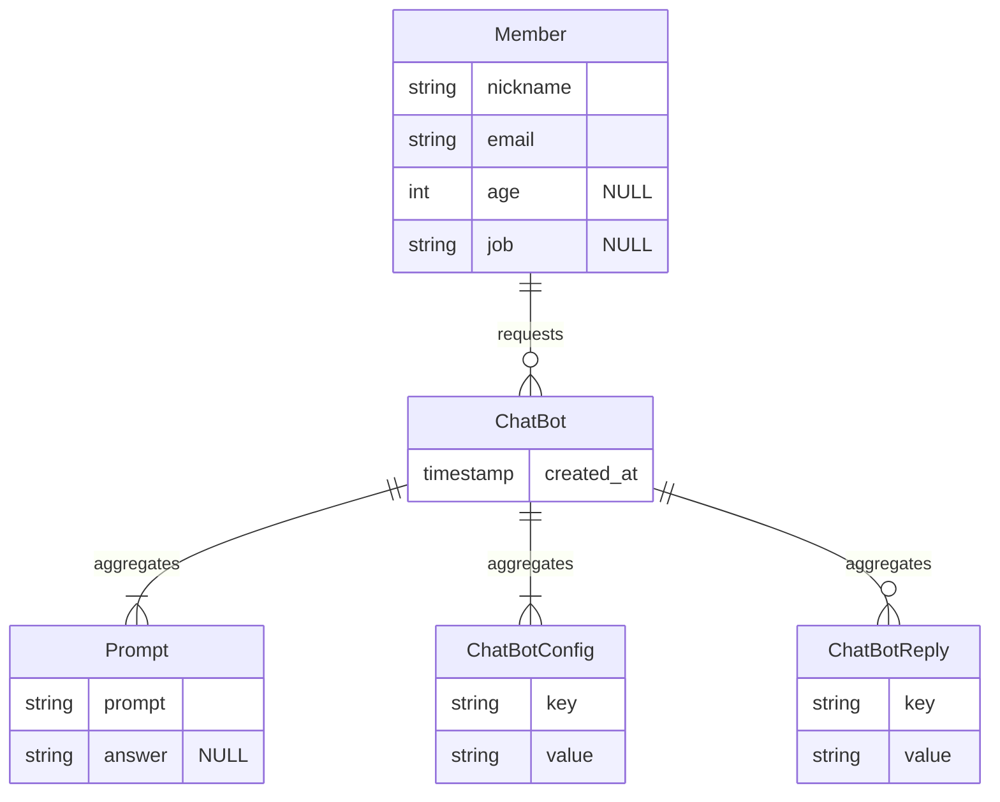

openai request, response는 JSON 형식을 갖고있고, JSON은 반정형 데이터이기 때문에 정형 데이터를 저장하는 SQL에 있어서 커다란 장애물이 된다. 이 문제를 해소하고 확장성을 높이기 위해 WordPress의 스타일을 차용하였다. `key`, `value` 쌍을 저장하는 것이다. 쿼리 속도는 늦어질지 몰라도 적어도 1단계 깊이의 객체를 표현할 수 있다. 

`ChatBotconfig`는 request에서 필요한 데이터들을 저장한다. 아래 example request을 보면 `"model"` 이 그 예이다. [Create chat completion](https://platform.openai.com/docs/api-reference/chat/create) 쪽을 보면 필요한 key, value 쌍에 무엇이 필요한지 알 수 있다.

- **`model`**: chat gpt의 모델
- **`messages`**: 세션 안에서 GPT와 대화한 내역을 모두 저장하여야 한다. 아래는 배열 안에 들어간다.
	- **`role`** : `system`, `user`, `assistant`, `function` 중 하나를 가진다.
	- **`content`**: 메시지의 내용. 함수호출일 경우 비어있을 수도 있다.
- **`functions`**: JSON을 인자로 넣는 함수의 리스트를 정의 ~~근데 잘 모르겠다~~
	- **`name`**: 호출할 함수 이름
	- **`parameters`**: 인자, JSON 형식
- **`stream`**: True일 경우 부분 메시지가 함께 보내진다. 실시간으로 응답이 들어오기 때문에 유저가 지루하지 않다는 장점이 있다.

나는 OpenAI의 Response만 어떻게 잘 처리하면 된다. request를 JSON으로 만드는 것은 데이터베이스의 문제가 아니기 때문이다. 

`ChatBotReply`에게 필요한 건 확장성인가, `message.text`만 있으면 되는가.

멘토님께 질문하고 나니 굳이 이렇게 key, value를 사용할 필요는 없어보인다. JSON을 형식 그대로 저장하고 싶다면 MongoDB를 써도 되지만 나는 단순한 스키마를 채택하는 것이 정신건강에 이로울 것 같다. openai의 API 응답을 그대로 재현할 필요는 없지 않을까?

#### 2차: 스키마 고정
