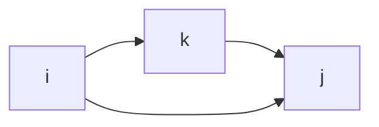

---
description:
title: 플로이드 워셜 알고리즘 - 그래프 모든 정점에 ad08359b30964c31a194cd5af80c8628
created: 2023-02-13T06:16:28
categories: 
 - 알고리즘
 - dp
 - graph
aliases: 
 - 플로이드 워셜 알고리즘
 - floyd warshall
 - graph
 - 
tags: [" algo/dp algo/graph  ", algo/dp, algo/graph]
date created: Monday, February 13th 2023, 6:16:28 am
date modified: Monday, February 27th 2023, 6:20:45 pm
updated: 2023-07-11T15:21:08
---
parent link: [[0011 Algorithms ♾️]]

---

# 플로이드 워셜 알고리즘 - 그래프 모든 정점에서의 최단경로


---

상태: 정리완료
태그: dp, graph

가중 그래프의 모든 꼭짓점 쌍에 대한 최단경로의 길이를 구해낼 수 있다. 경유 가능한 지점을 하나씩 추가해 가면서 최소값만을 dp에 갱신하는 것으로 구현이 가능하다.



- k = 0일 때
    
    ```mermaid
    graph LR
      i --"D(i,j,0)"--> j
    ```
    
    ```python
    D(i,j,0) = W[i][j]
    ```
    
- k = 1일 때
    
    ```mermaid
    graph LR
    	i --"D(i,1,0)"--> 1
    	1 --"D(1,j,0)"--> j
    	i --"D(i,j,0)"--> j
    ```
    
    ```python
    D(i,j,1) = min(D(i,j,0), 
    		(D(i, 1, 0) + D(1, j, 0))
    
    ```
    
- k = 2일 때
    
    ```mermaid
    graph LR
    	i -- "D(i,2,0)" --> 2
    	2 --"D(2,j,0)"--> j
    	i --"D(i,j,1)"--> j
    ```
    
    ```python
    D(i,j,2) = min(D(i,j,1), 
    		(D(i, 2, 0) + D(2, j, 0))
    
    ```
    
- 일반화 (k = m일때)
    
    i에서 m을 경유하여 j로 가는 길이 versus 기존에 i,j 와의 최단경로를 비교하여 작은 것을 `D(i, j, m)` 에 갱신한다.
    
    ```mermaid
    graph LR
    	i -- "D(i,m,0)" --> m
    	m --"D(m,j,0)"--> j
    	i --"D(i,j,m-1)"--> j
    ```
    
    ```python
    D(i,j,m) = min(D(i, j, m - 1), 
    		(D(i, m, 0) + D(m, j, 0))
    
    ```
    

# pseudo code

[플로이드-워셜 알고리즘 - 위키백과, 우리 모두의 백과사전](https://ko.wikipedia.org/wiki/%ED%94%8C%EB%A1%9C%EC%9D%B4%EB%93%9C-%EC%9B%8C%EC%85%9C_%EC%95%8C%EA%B3%A0%EB%A6%AC%EC%A6%98)

```python
let dist be a |V| × |V| array of minimum distances initialized to ∞ (infinity)
for each edge (u,v)
   dist[u][v] ← w(u,v)  // 변 (u,v)의 가중치
for each vertex v
   dist[v][v] ← 0
for k from 1 to |V|
   for i from 1 to |V|
      for j from 1 to |V|
         if dist[i][j] > dist[i][k] + dist[k][j]
            dist[i][j] ← dist[i][k] + dist[k][j]
        end if
```

# 시간복잡도

$O(N^3)$ 각 쌍을 탐색하는 데 $O(N^2)$, k가 1~n-1까지 변하므로 $O(N)$