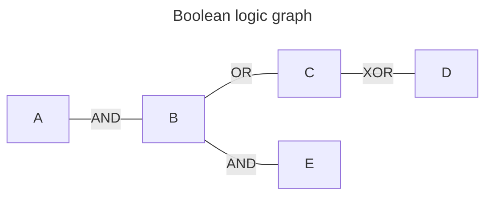

# `F()`

<https://docs.djangoproject.com/en/4.2/ref/models/expressions/#f-expressions>

> F() 개체는 모델 필드의 값, 모델 필드의 변환된 값 또는 주석이 달린 열을 나타냅니다. 이를 통해 모델 필드 값을 참조하고 이를 사용하여 데이터베이스 작업을 수행할 수 있으므로 실제로 데이터베이스에서 파이썬 메모리로 가져올 필요 없이 데이터베이스 작업을 수행할 수 있습니다.

ORM을 사용할 때 파이썬이 아니라 DB 자체 쿼리를 사용하게 만들어주는 메서드. 

```python
Post.objects.annotate(title=F("post__comment")).values("title")
```

## high performance

벌크 업데이트를 수행할 때 파이썬으로 가져올 필요가 없으므로 성능이 높다.

```python
Reporter.objects.update(stories_filed=F("stories_filed") + 1)
```

## race conditions

또, DB가 필드 값을 업데이트 하므로 race condition이 일어나지 않는다는 점도 장점이라고

## returns PK rather than model instance

```python
Company.objects.annotate(built_by=F("manufacturer"))[0]
```

# `Q()` 

- <https://docs.djangoproject.com/en/4.2/topics/db/queries/#complex-lookups-with-q-objects>
- source code: <https://github.com/django/django/blob/stable/5.1.x/django/db/models/query_utils.py#L38>

AND(`&`), OR(`|`), NOT(`~`), XOR(`^`) 연산을 좀 더 편하게 만들어준다.

```python
Poll.objects.get(
    Q(question__startswith="Who"),
    Q(pub_date=date(2005, 5, 2)) | Q(pub_date=date(2005, 5, 6)),
)
```

**사용사례**

쿼리 파라메터로 필터링을 수행할때 어떤 옵션은 하나의 filter로 끝나지 않는 경우가 있었다. 예를 들어 메모들을 쿼리하는데 태그를 필터링하고자 할 경우, 필터링 하는 태그가 여러개일 수도 있다. 이 경우 반복문을 사용하여 filter를 해야 하는데, 이때 Q 객체를 쓰면 편하다.

```python
class MemoListView(APIView):
    @extend_schema(
        summary="메모 조회",
        description="날짜와 다양한 분류,정렬 기준으로 사용자의 메모를 조회합니다.",
        parameters=[
            OpenApiParameter(
                name="tag[]",
                description="태그 필터. 태그 이름은 고유하기 때문에 tag_title을 사용합니다. 다중인자를 허용합니다.",
                required=False,
                type=str,
                many=True,
            ),
            ...
        ],
    )
    def get(self, request):
        user = request.user
        queryset = self.queryset.filter(memo_set__user_id=user.id)

		...

        # `tag` filtering
        if param.get("tag[]"):
            tags = param.getlist("tag[]")
            q = Q()
            for tag_title in tags:
                q |= Q(memo_tags__title=tag_title)

            queryset = queryset.filter(q)

```

source code를 살펴보니 Q 오브젝트는 `tree.Node`를 상속받았다. 그 말은 즉슨 Q 오브젝트끼리 부모-자식 관계가 가능하다는 것이다. `Node.create`를 하고 새 Q 오브젝트를 `add`했다. 이때 Connector가 항상 따라붙는데, 간선에 OR, AND, XOR 연산을 정의하기 위해 사용하는 것 같다. 부울대수는 트리구조로 만들 수 있고, 그 정점끼리는 Q 오브젝트가 있으며, 간선은 정점간의 operator가 있는 셈이다. 

예를 들어 `A & ((B | (C ^ D)) & E)` 를 트리구조로 표현하면 다음과 같이 될 것이다:



