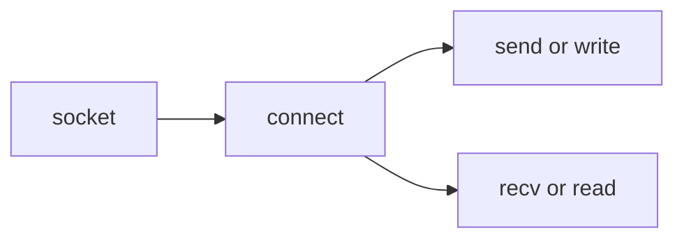
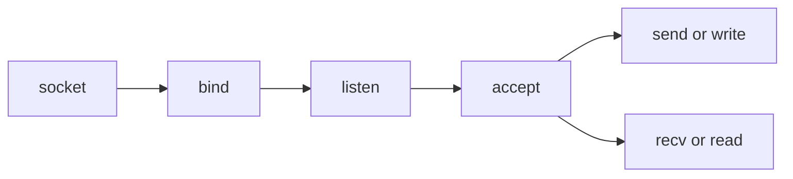

- [[0017 C 🍎]]
___

## Socket Programming Tutorial In C For Beginners

<iframe title="Socket Programming Tutorial In C For Beginners | Part 1 | Eduonix" src="https://www.youtube.com/embed/LtXEMwSG5-8?feature=oembed" height="113" width="200" allowfullscreen="" allow="fullscreen" style="aspect-ratio: 1.76991 / 1; width: 50%; height: 50%;"></iframe>

**Client socket workflow**

- [[socket(2)]] | 소켓을 생성하여 file descriptor를 리턴받는다.
- [[connect(2)]] | 서버에게 커넥션을 요청한다.
- [[recv(2)]] | recieve data from the server

**Server socket workflow**

- [[bind(2)]] | 소켓에 ip, port쌍을 바인드 한다.
- `listen(socket, backlog)`: `accept`를 통해 들어오는 연결들을 관리한다. `backlog`를 사용하여 최대 소켓 수를 정의할 수는 있는데, 동시성 프로그래밍과는 별개인 것 같다.
- [[accept(2)]] `accept(socket, struct sockaddr *, socklen_t *)`: 클라이언트 소켓을 받는다. 두 번째, 세 번째 인자를 넣어 클라이언트의 주소를 얻을 수 있다.
- `send(socket, char *buf, int buflen, flag)`: 지정한 소켓으로 메시지를 보낸다.

## Network Address Translation

- [[getnameinfo(3)]]
- [[getaddrinfo(3)]]
- [[htonl, htons, ntohl, ntohs {htonl(3)}]]
- [[sockaddr(3type)]]
