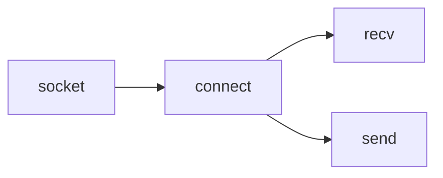
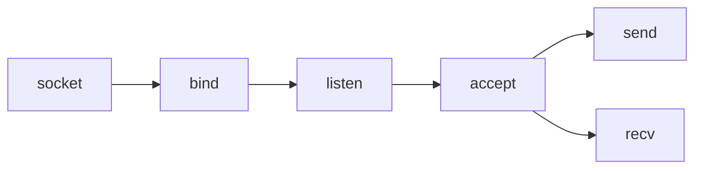

## Socket Programming Tutorial In C For Beginners

<iframe title="Socket Programming Tutorial In C For Beginners | Part 1 | Eduonix" src="https://www.youtube.com/embed/LtXEMwSG5-8?feature=oembed" height="113" width="200" allowfullscreen="" allow="fullscreen" style="aspect-ratio: 1.76991 / 1; width: 50%; height: 50%;"></iframe>

**Client socket workflow**

- `socket(AF_INET, SOCK_STREAM, 0)`: 소켓을 생성하여 file descriptor를 리턴받는다.
- `struct sockaddr_in`: 소켓에 구체적인 주소를 지정한다. (IP, port)
	- `.sin_family`
	- `.sin_port`
		- `htons(int port)`: 포트번호를 변환한다.
	- `.sin_addr.s_addr`: 클라이언트가 허용할 IP주소를 지정한다. `INADDR_ANY`는 `0.0.0.0`과 동일하다.
- `connect(socket, struct sockaddr *, size of address)`: establish connection, return 0 on success, -1 on failure
- `recv(socket, char * server_response, size of buffer, 0)`: recieve data from the server
- `close(socket)`

**Server socket workflow**

- `bind(socket, struct sockaddr *, size of address)`:  소켓에 ip, port쌍을 바인드 한다.
- `listen(socket, backlog)`: `accept`를 통해 들어오는 연결들을 관리한다. `backlog`를 사용하여 최대 들어오는 요청 수를 정의할 수는 있는데, 동시접속을 허용하려면 동시성 프로그래밍을 다뤄야 한다...
- `accept(socket, struct sockaddr *, socklen_t *)`: 클라이언트 소켓을 받는다. 두 번째, 세 번째 인자를 넣어 클라이언트의 주소를 얻을 수 있다.
- `send(socket, char *buf, int buflen, flag)`: 지정한 소켓으로 메시지를 보낸다.
