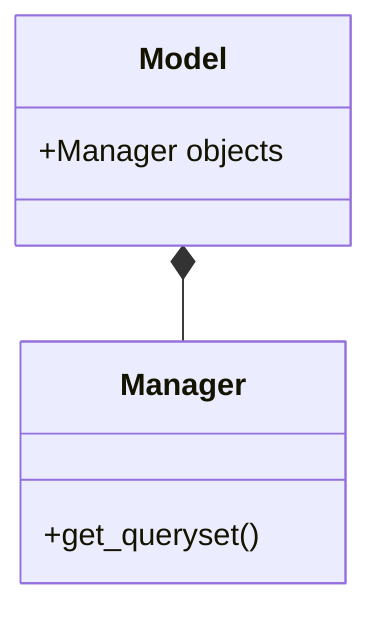

- link:
	- [[django model]]
	- [Post 안에 PostObjects 클래스를 정의하는 예시 {YT}](https://youtu.be/soxd_xdHR0o?t=2727)
___

# diagram

이렇게 오버라이드를 하면 좋은 점이 기본적으로 쿼리셋을 호출하는 시점 중 가장 처음에 자동으로 호출이 되어 초기 필터링 따위를 수행할 수 있다는 것이다. `Model.objects`로 시작하는 쿼리는 디폴트로 모든 데이터들을 긁어오지만 유튜브 예시와 같이 사전에 필터를 걸면 `Model.objects.all`을 해도 원치않는 데이터를 보이지 않게 만드는 효과가 있다.

물론 영상에서는 `postobjects`라는 이름의 사전 필터링된 쿼리셋을 리턴하는 인스턴스를 따로 만들어 관리하고는 있다.

