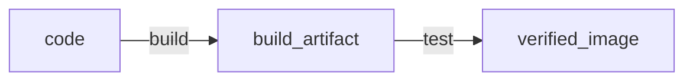

이 장은 Continuous Integration, 지속적 통합에 관한 내용을 다룬다. 통합이란, 빌드와 테스팅을 정기적으로 수행하는 절차를 의미한다. 통합은 빌드, 테스트, 배포 단계와 같이 일련의 파이프라인으로 이루어져 있는데, CI를 통과한 이미지는 코드 상태가 정상이고 패키징이 끝나 릴리즈 후보로 적합한 상태임을 의미한다. 그러면 이 통합과정을 도맡아서 할 서버와 서비스가 필요한데, 이 작업또한 컨테이너 이미지의 형태로 제공된다. CI 서버를 따로 구축하면 프로젝트 구현과 테스팅, 배포 작업을 분리할 수 있어 생산성이 높아진다.

**자동화 관점에서의 통합**

- 도커파일은 App을 패키징하는 역할을 가진다. 앱을 빌드하고 실행하는 절차를 기술한다.
- 도커 컴포즈는 App 아키텍처를 정의하는 역할을 가진다. 앱들의 의존성을 정의하고 실행과 종료 절차에 대해 기술한다.
- 명령행 도구 (command line)는 App의 자동화를 책임진다. cron 스케줄링을 할 수도 있으며, 코드 푸시 이벤트에 반응하도록 만들 수도 있다.



CI 서버를 대신해주는 서비스가 바로 Jenkins이다. 우리가 도커 엔진의 기능을 사용하는 인터페이스로 docker-cli를 사용했지만 인간 대신에 별개의 서버에서 도커 엔진에 API를 보낼 수도 있다는 것은 이전 장에서 배우고 왔을 것이다. 그렇지만 약간의 세팅이 필요한데, Jenkins 설정을 위해 도커 네트워크를 정의해주어야 한다. 일반적인 브릿지 네트워크가 아닌, ==volume== 타입의 네트워크를 정의하여 파일을 기반으로 소켓통신의 통로를 놓아주어야 한다. 

> 유닉스 시스템에서 모든 것은 파일이다 - Ken Thompson & Dennis Ritchie

~~그냥 DNS 쓰면 되는거 아님?~~

---

## 도커를 이용한 빌드 인프라스트럭처 구축하기

11.2 절에서는 CI 서비스를 사용하지 않고 도커화된 CI 서비스 도구를 직접 설치해 실행해보는 것을 목표로 한다.

**WHY?** ⇒ CI 빌드 도구를 구축해보는 연습을 하면 나중에 다른 서비스로 갈아탈때 쉬워지기 때문. 또한 보안 이슈나 네트워크 outage로 인한 비상상황을 대비할 수 있다.

- 형상관리도구 → Gogs
- 이미지 레지스트리 → 도커 레지스트리 컨테이너
- 자동화 서버 → Jenkins

---

`docker image inspect`를 사용하여 이미지 메타데이터인 **라벨**을 확인할 수 있다. 라벨의 예시는 아래와 같다:

```
```

---

docker-compose 환경변수 정의하는 문법 `${VAR}` 에 더 나아가서, 기본값을 정의할 수 있다. `${VAR:-default-value}`

---

Dockerfile 안에서만 쓸 환경변수도 선언할 수 있다. `ARG` 명령을 사용하면 된다. 이 변수는 `--build-arg` 플래그를 사용하여 오버라이드가 가능하다. ~~확장에 미친 프로그램~~

---

> 상업용으로 제공되는 파이프라인 작성 문법 대신 일반적인 스크립트로 작성해 파이프라인에서 호출하는 이런 패턴은 빌드 서비스를 갈아타이게도 유리하다. 깃랩이나 깃허브 액션으로 빌드 서비스를 변경하더라도 파이프라인 스크립트만 추가하면 동일하게 동작하기 때문이다.
