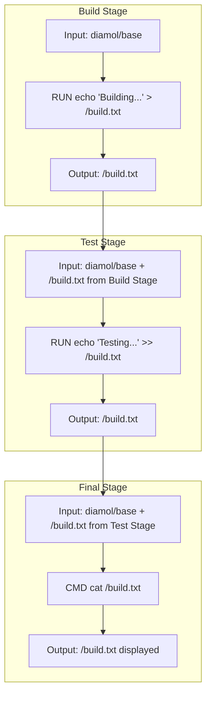

## 도커를 빌드 도구로 활용하기

- 소프트웨어 빌드 도구로 활용 가능한 도커
	- 빌드 과정이 복잡한 경우 중간에 사용하느 빌드 도구의 환경을 동일하게 맞추는 것도 어려울 수 있다. 이 경우 빌드 툴체인을 공유할 수 있다. 
	- 예를 들어 프로그램을 빌드 하기 위해 참여하는 링커, 컴파일러, 패키지 관리자, 런타임 환경 전부 도커파일 안에 정의할 수 있다.
- 빌드 도구와 도커 스테이징은 무슨 관계이지?
	- 각 스테이지별로 사용하는 기반 이미지 `FROM`이 다를수도 있다. 이 경우 기반 이미지를 한데 모아서 큰 기반 이미지를 만들어도 되지만 스테이징을 하여 관리할 수도 있다.
	- 각 단계별로 목적이 뚜렷한 경우 스테이징 할 수 있다. 빌드 스테이지, 테스트 스테이지 등과 같이 말이다. 이때 각 스테이징을 위해 사용하는 기반 이미지에 별칭을 붙일 수 있는데, `AS` 키워드를 사용할 수 있다.
		- `AS` 키워드로 정의한 스테이지 별칭은 `COPY --from=<stage>` 에서 참조할 수 있다. 이전 스테이지의 산출물을 공유하지 않기 때문에 꼭 `COPY` 명령어를 써주는 것 같다.
- `RUN` 인스트럭션은 컨테이너 안에서 실행할 명령어를 정의한다. 셸 스크립트로 작성한다.



- 빌드 서버는 소스코드와 도커파일을 가지고  `docker build`를 하여 아티팩트가 포함된 이미지를 생성한다.
- 배포서버는 아티팩트가 포함된 이미지를 pull 받아 단순히 `doker run`을 한다.
- 위 두 작업을 자동화 해주는 녀석이 CI (Continuous Integration) 인 것이다.

## CMD와 ENTRYPOINT의 차이점이 뭔가요?

### Key Differences:

1. **Overriding**:
    - `CMD` can be overridden by providing a command at the end of `docker run`.
    - `ENTRYPOINT` cannot be overridden by `docker run` arguments (unless you explicitly use `--entrypoint`).
2. **Intent**:
    - Use `CMD` for default, flexible commands that can be overridden.
    - Use `ENTRYPOINT` when you want a fixed command that will always run.

In summary, `CMD` is better suited for default commands that can be changed, while `ENTRYPOINT` is used for mandatory commands that should always be executed when the container starts.

## 도커 가상 네트워크

도커 컨테이너끼리 통신을 주고받기 위해선 가상 네트워크 (로컬 네트워크)를 구축하고 그 안에 컨테이너들을 할당해주어야 한다. 그러면 그 안에서 가상 IP주소를 발급받게 되고 EXPOSE한 포트번호를 통하여 네트워크 통신을 하게 된다.

```
docker container network <docker-network-name>
```

## 멀티스테이지빌드는 각각의 스테이지가 별도의 이미지로 분리된다고?

> p.99 최종 애플리케이션 이미지에 Go 빌드 도구가 포함이 되지 않아 750MB나 달하는 용량을 줄일 수 있는 것이다.

그 증거로 다음 명령어를 통해서 이미지별 정보를 출력해보면...

```
$ docker image ls -f reference=diamol/golang -f reference=image-gallery
REPOSITORY      TAG       IMAGE ID       CREATED              SIZE
image-gallery   latest    12b68e489c57   About a minute ago   17.1MB
diamol/golang   latest    119cb20c3f56   4 years ago          803MB
```

go 프로젝트 배포를 위한 Dockerfile은 두 가지 스테이지로 구분되어있다.

1. golang 빌드 ⇒ `FROM diamol/golang` | SIZE 803MB
2. go 바이너리 실행 ⇒ `FROM diamol/base` | SIZE 17.1MB

이렇게 하면 이미지를 배포할때 굳이 필요없는 빌드도구를 포함하지 않고 가벼운 상태로 레지스트리에 올리고 실행할때에도 용량을 적게 먹을 것 같다.
