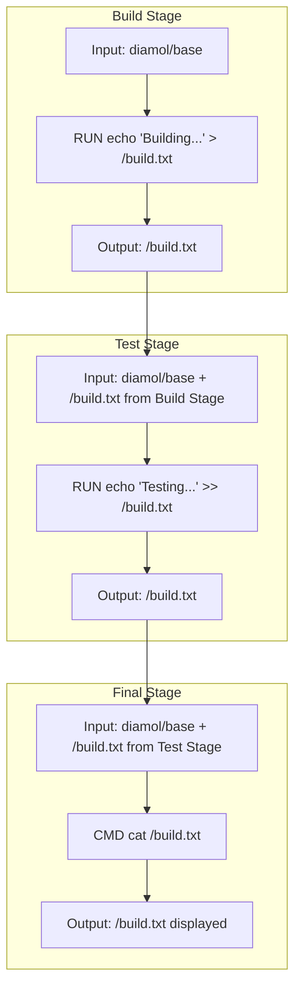

## 도커를 빌드 도구로 활용하기

- 소프트웨어 빌드 도구로 활용 가능한 도커
	- 빌드 과정이 복잡한 경우 중간에 사용하느 빌드 도구의 환경을 동일하게 맞추는 것도 어려울 수 있다. 이 경우 빌드 툴체인을 공유할 수 있다. 
	- 예를 들어 프로그램을 빌드 하기 위해 참여하는 링커, 컴파일러, 패키지 관리자, 런타임 환경 전부 도커파일 안에 정의할 수 있다.
- 빌드 도구와 도커 스테이징은 무슨 관계이지?
	- 각 스테이지별로 사용하는 기반 이미지 `FROM`이 다를수도 있다. 이 경우 기반 이미지를 한데 모아서 큰 기반 이미지를 만들어도 되지만 스테이징을 하여 관리할 수도 있다.
	- 각 단계별로 목적이 뚜렷한 경우 스테이징 할 수 있다. 빌드 스테이지, 테스트 스테이지 등과 같이 말이다. 이때 각 스테이징을 위해 사용하는 기반 이미지에 별칭을 붙일 수 있는데, `AS` 키워드를 사용할 수 있다.
		- `AS` 키워드로 정의한 스테이지 별칭은 `COPY --from=<stage>` 에서 참조할 수 있다. 이전 스테이지의 산출물을 공유하지 않기 때문에 꼭 `COPY` 명령어를 써주는 것 같다.
- `RUN` 인스트럭션은 컨테이너 안에서 실행할 명령어를 정의한다. 셸 스크립트로 작성한다.

