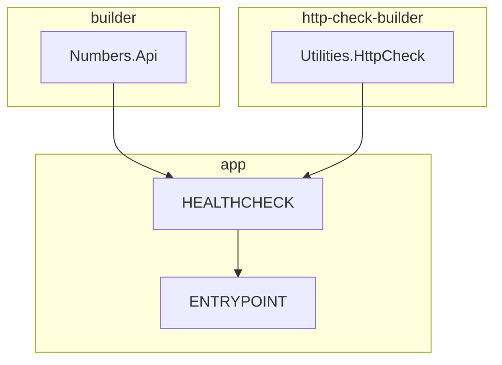

## HEALTHCHECK 

도커 컨테이너는 프로세스가 종료되면 같이 종료가 되지만 Status 500과 같이 내부 상태가 정상적이지 않은 상황에 프로세스는 살아있는 경우 컨테이너는 이를 판단하지 못한다. 이를 위하여 `HEALTHCHECK` 옵션이 존재한다. 인자로 임의의 커맨드가 들어가며, curl을 사용하여 임의의 `/health` 엔드포인트에 GET 요청을 주기적으로 보내 컨테이너 상태를 파악하는 기능을 제공한다.

> ch08/exercises/numbers/numbers-api/Dockerfile.v2

`curl --fail` 옵션은 응답결과가 정상이면 0을, 비정상인 경우 0이 아닌 값을 반환한다. 이 값을 도커가 healty, unhealty 상태로 인식하게 된다.

```Dockerfile
FROM diamol/dotnet-sdk AS builder

WORKDIR /src
COPY src/Numbers.Api/Numbers.Api.csproj .
RUN dotnet restore

COPY src/Numbers.Api/ .
RUN dotnet publish -c Release -o /out Numbers.Api.csproj

# app image
FROM diamol/dotnet-aspnet

ENTRYPOINT ["dotnet", "/app/Numbers.Api.dll"]
HEALTHCHECK CMD curl --fail http://localhost/health

WORKDIR /app
COPY --from=builder /out/ .
```

```sh
$ docker ps

IMAGE                      COMMAND                  STATUS                  
diamol/ch08-numbers-api:v2 "dotnet /app/Numbers…"   Up 8 minutes (unhealthy)
```

이제 unhealty한 컨테이너를 inspect 하면 JSON 파일을 받아볼 수 있다. `State.Health.Log` 를 보면 ExitCode가 22이고 Output이 500 Internal Server Error 임을 확인할 수 있다.

```
$ docker container inspect $(docker container ls --last 1 --format "{{.ID}}")
```

```json
[
    {
        "Id": "dea679c75a7211bfc19be8a0dd0569d8ee2577155a823806a20d0114f4b0eb7f",
        "Created": "2024-10-28T14:16:28.793534681Z",
        "Path": "dotnet",
        "Args": [
            "/app/Numbers.Api.dll"
        ],
        "State": {
            "Status": "running",
            "Running": true,
            "Paused": false,
            "Restarting": false,
            "OOMKilled": false,
            "Dead": false,
            "Pid": 213315,
            "ExitCode": 0,
            "Error": "",
            "StartedAt": "2024-10-28T14:16:28.862957107Z",
            "FinishedAt": "0001-01-01T00:00:00Z",
            "Health": {
                "Status": "unhealthy",
                "FailingStreak": 27,
                "Log": [
                    {
                        "Start": "2024-10-28T23:30:31.489796749+09:00",
                        "End": "2024-10-28T23:30:31.569449709+09:00",
                        "ExitCode": 22,
                        "Output": "  % Total    % Received % Xferd  Average Speed   Time    Time     Time  Current\n                                 Dload  Upload   Total   Spent    Left  Speed\n\r  0     0    0     0    0     0      0      0 --:--:-- --:--:-- --:--:--     0\r  0     0    0     0    0     0      0      0 --:--:-- --:--:-- --:--:--     0\ncurl: (22) The requested URL returned error: 500 Internal Server Error\n"
                    }
                ]
            }
        },
	...
]
```

## 디펜던시 체크

디펜던시 체크는 도커 컴포즈에서 배웠던 `depends_on` 과 비슷하면서도 사뭇 다르다. 도커 컴포즈는 하나의 서버에서 굴릴 컨테이너들을 관리할 목적이고 이 책에서 소개하는 디펜던시는 여러 서버에 걸쳐있는 **클러스터**에서의 의존성 체크를 하는 방법을 의미한다. 물론 아직 클러스터링을 배우지 않았지만 왜 필요한지, `depends_on`의 한계가 무엇인지는 알고 넘어가야 한다.

디펜던시 체크와 관련한 명령어는 따로 없다. 단지 이미지를 run할때 애플리케이션이 실행되지 않게 만드는 로직을 추가하면 된다. 어차피 쿠버네티스 같은 녀석이 죽은 컨테이너를 다시 실행시켜줄테니깐.

### 방법1. Dockerfile에서 직접 의존 컨테이너에 요청을 보내기

만약 `CMD` 명령의 `curl`이 정상적으로 실행이 되었다면 `&&` 우측에 있는 명령을 실행하고 컨테이너가 생성될 것이다. 만약 아니라면 컨테이너는 만들어지다 exit 될 것이다.

```Dockerfile
FROM diamol/dotnet-sdk AS builder

WORKDIR /src
COPY src/Numbers.Web/Numbers.Web.csproj .
RUN dotnet restore

COPY src/Numbers.Web/ .
RUN dotnet publish -c Release -o /out Numbers.Web.csproj

# app image
FROM diamol/dotnet-aspnet

ENV RngApi:Url=http://numbers-api/rng

CMD curl --fail http://numbers-api/rng && \
    dotnet Numbers.Web.dll

WORKDIR /app
COPY --from=builder /out/ .
```

### 방법2. 커스텀 유틸리티를 실행시키기

실무 목적으로 `curl`을 사용하는 것은 권장되지 않는다. 왜냐하면 불필요하게 이미지 크기를 늘리고 외부 공격에 노출될 여지가 있기 때문이다. 컨테이너가 너무 많은 유틸리티를 가지고 있으면 해커가 컨테이너에 접근권한을 획득했을때 할 수 있는 도구도 많아지는 셈이다.

따라서, 이미지를 빌드할때 같은 기반 이미지를 공유하는 커스텀 유틸리티를 만들어 헬스체크와 디펜던시 체크에 활용하는 것이 유용하다.

```Dockerfile
FROM diamol/dotnet-sdk AS builder

WORKDIR /src
COPY src/Numbers.Api/Numbers.Api.csproj .
RUN dotnet restore

COPY src/Numbers.Api/ .
RUN dotnet publish -c Release -o /out Numbers.Api.csproj

# http check utility
FROM diamol/dotnet-sdk AS http-check-builder

WORKDIR /src
COPY src/Utilities.HttpCheck/Utilities.HttpCheck.csproj .
RUN dotnet restore

COPY src/Utilities.HttpCheck/ .
RUN dotnet publish -c Release -o /out Utilities.HttpCheck.csproj

# app image
FROM diamol/dotnet-aspnet

ENTRYPOINT ["dotnet", "Numbers.Api.dll"]
HEALTHCHECK CMD ["dotnet", "Utilities.HttpCheck.dll", "-u", "http://localhost/health"]

WORKDIR /app
COPY --from=http-check-builder /out/ .
COPY --from=builder /out/ .
```



**애플리케이션과 같은 기반으로 커스텀 유틸리티를 만들면 좋은 점**

- 별도의 도구를 레이어에 포함시킬 필요가 없다.
- 비단 디펜던시, 헬스체크만 하는 것이 아니라 DB 연결, 환경변수가 올바르게 갖추어져있는지 등을 미리 검사할 수 있다.

## 도커 컴포즈에 헬스체크와 디펜던시 체크 정의하기

도커컴포즈에도 헬스체크를 수행할 수 있고 컨테이너를 재실행 시킬 수는 있다. 하지만 컨테이너를 종료시켰다 새 컨테이너로 실행시키는 일은 할 수 없다. 아래 컴포즈 파일 중 `healthcheck`와 `restart` 부분을 유심히 보자. 

numbers-web은 numbers-api에 의존하고 있지만 `depends_on`을 사용하지 않았다. 만약 numbers-web이 먼저 초기화 된다면 아마도 애플리케이션을 실행시키지 못할 것이다. 이때 `restart: on-failure`가 빛을 발휘하여 다시 numbers-web을 실행하게 된다. 그 사이 numbers-api가 초기화 되면 정상작동하는 것이다.

```yml
version: "3.7"

services:
  numbers-api:
    image: diamol/ch08-numbers-api:v3
    ports:
      - "8087:80"
    healthcheck:
      interval: 5s
      timeout: 1s
      retries: 2
      start_period: 5s
    networks:
      - app-net

  numbers-web:
    image: diamol/ch08-numbers-web:v3
    restart: on-failure
    environment:
      - RngApi__Url=http://numbers-api/rng
    ports:
      - "8088:80"
    healthcheck:
      test: ["CMD", "dotnet", "Utilities.HttpCheck.dll", "-t", "150"]
      interval: 5s
      timeout: 1s
      retries: 2
      start_period: 10s
    networks:
      - app-net

networks:
  app-net:
    external:
      name: nat
```

아래 페이지에 접속해 랜덤 숫자 네개를 받고나서부터는 unhealty 상태로 바뀌고 Api 서버에서 요청을 받을 수 없게된다. 그렇지만 도커 컴포즈도 unhealty 상태인 컨테이너를 갈아끼울 수는 없다.

![[Screenshot From 2024-10-29 00-55-19.png]]

```
CONTAINER ID   IMAGE                                COMMAND                  CREATED         STATUS                     PORTS                                       NAMES
cd01eda8d371   diamol/ch08-numbers-web:v3           "/bin/sh -c 'dotnet …"   2 minutes ago   Up 2 minutes (healthy)     0.0.0.0:8088->80/tcp, [::]:8088->80/tcp     numbers-numbers-web-1
f769c7eb04da   diamol/ch08-numbers-api:v3           "dotnet Numbers.Api.…"   2 minutes ago   Up 2 minutes (unhealthy)   0.0.0.0:8087->80/tcp, [::]:8087->80/tcp     numbers-numbers-api-1
```
