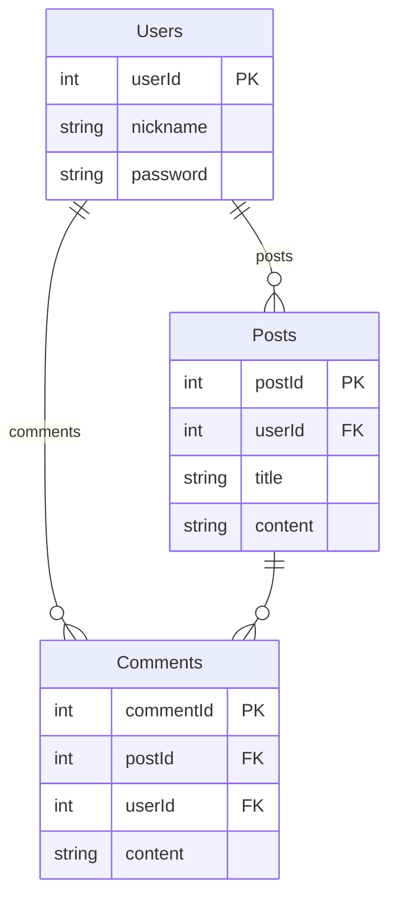
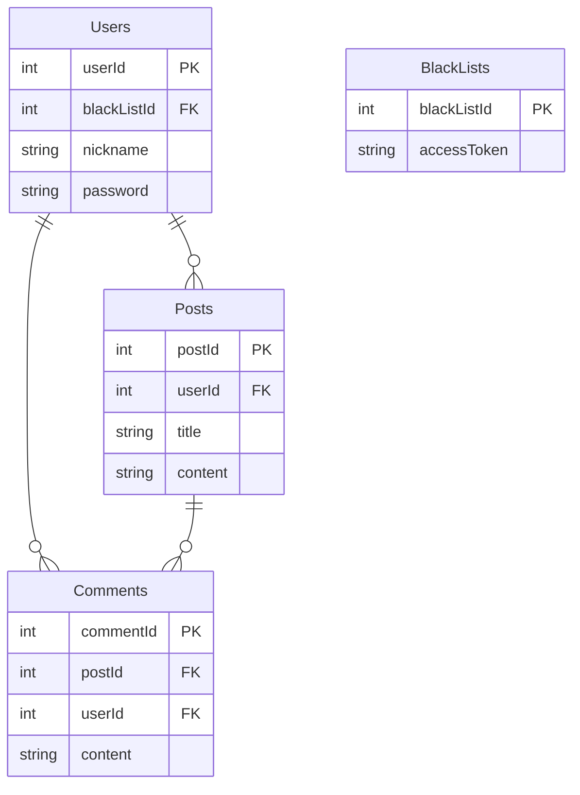

- [[express.js]]
- [[week13 {swjugle}{team creation} {expressjs}]]
- <https://github.com/ChoiWheatley/swjungle-week13>
___

## SRS

> CRUD 가능한 게시판 + JWT를 활용한 회원 인증/인가기능을 포함한 백엔드 서버 만들기 (REST API)

### Mandatory

- APIs
	- [x] 전체 게시글 조회
	- [x] 게시글 조회
	- [x] 게시글 작성
	- [x] 게시글 수정
	- [x] 게시글 삭제
	- [x]  댓글목록 조회
	- [x]  댓글작성
	- [x]  댓글수정
	- [x]  댓글삭제
	- [x] 회원가입
	- [x] 로그인

- Post
	- title
	- content
	- author
	- createdAt
	- updatedAt
- Comment
	- content
	- author
	- createdAt
	- updateAt
- User
	- nickname
	- password ~~비밀번호를 그대로?~~

## milestone

> 게시글 + 댓글 회원없이 연결 ⟶ 회원관리 with [[Securities about {https} and {jwt {cookie}, {session}}|JWT]] ⟶ Post, Comment에 `author` FK로 변경 ⟶ 배포

### 게시글 + 댓글 회원없이 연결

[[sequelize, a MySQL ORM for javascript]]

- ~~회원없이 CRUD 가능한 Post, Comment 빠르게 구현하고 DB에 잘 들어가는지 테스트.~~

- Post **has many** Comment 관계
	- 일단 migration이 필요함. 스키마를 바꿔야한다.
	- Comment
		- ...
		- postId (FK)

	 ```mermaid
		erDiagram
		Post ||--o{ Comment : ""
	```

	- 바뀌는 Posts api routing
		- `GET /post/:postId/comment`  
			- response: 

			```json
			"data": [
				{
					"author": "ChoiWheatley",
					"commentId": 2,
					"content": "my first comment",
					"createdAt": "2023-11-05T14:29:44.000Z",
					"updatedAt": "2023-11-05T14:29:44.000Z"
				},
				{
					"author": "ChoiWheatley",
					"commentId": 2,
					"content": "my first comment2",
					"createdAt": "2023-11-05T14:29:44.000Z",
					"updatedAt": "2023-11-05T14:29:44.000Z"
				}
			]
			```

			- 저장은 잘 됐는데, 이걸 어떻게 꺼낼 수 있을지 모르겠다. [fetching associations](https://sequelize.org/docs/v6/core-concepts/assocs/#fetching-associations---eager-loading-vs-lazy-loading) 참고

### 회원가입 / 로그인 / 로그아웃

기본코드들은 [[jsonwebtoken npm + user authentication authorization api]]에서 확인할 수 있다. 여기에선 사용자 인증 말고 사용자 인가에 대한 내용을 다뤄볼 것이다.

`jwt.verify(token, secertOrPublicKey)`를 사용하여 전달받은 토큰이 무결한지(훼손이나 변조가 이루어지지 않았는지) 검사할 수 있다. 예제코드는 다음과 같다. `token.split(" ")[1]`을 한 이유는 토큰에 `Bearer `를 앞에 집어넣었기 때문에 이를 제거하기 위해서였다.

```js
router.get("/testjwt", (req, res) => {
  const token = req.cookies.sparta;
  console.log(token);
  if (!token) {
    return res.status(404).json({ errorMessage: "토큰이 없습니다~" });
  }
  try {
    const payload = jwt.verify(token.split(" ")[1], "secretOrPrivateKey");
    return res.json({ data: payload });
  } catch (e) {
    console.log("💀", e);
    return res.sendStatus(403);
  }
});
```

- [ ] plain password가 그대로 저장되는 문제. [[bcypt npm]]
- [x] secret key를 .env 또는 환경변수에 저장해서 보안성을 높이자. 
	- `openssl rand -base64 32`
	- [npm install dotenv](https://www.npmjs.com/package/dotenv)
- [ ] refresh token을 발급하여 access token 만료시 재발급에 활용하자.

### Authorization

테이블 간에 연관관계를 재설정해야함. Posts, Comments 테이블에 Users에 대한 FK가 들어가야 한다.



- [ ] `/logout` api가 현재 하는 일이 없다. GPT한테 물어보니 블랙리스트 테이블을 갖추어 아직 만료가 덜된 토큰 중에서 로그아웃을 요청한 토큰을 저장한다. jwt 미들웨어에서 블랙리스트를 검사하는 코드를 추가한다. [[#Token Blacklist for Logged Out User]]

### 배포

- ec2 생성 및 리포지토리 클론해오기
- [nodesource](https://github.com/nodesource/distributions#installation-instructions)를 참조하여 nodejs 바이너리 설치하기 (어차피 개발자 도구가 설치될 필요가 없으므로)
- [pm2](https://www.npmjs.com/package/pm2)를 사용하여 백그라운드 프로세스로 실행시킨다. [pm2 명령어 모음](https://pm2.keymetrics.io/docs/usage/process-management/)

### Swagger

안해. 대신 postman에 문서를 만들어주는 기능을 활용할거야

- [ ] Postman Document 여기에 붙여넣으세요

### Token Blacklist for Logged Out User

- [x] **access token & refresh token**

[[Simple JWT package {drf}{rest_framework_simplejwt}]]를 조금 참고했다. 한 서버에서 access, refresh token을 발급하는 사례가 있어 이대로 진행하려고 한다.

참고로, access token은 기존 그대로 `req.headers["authorization"]` 헤더에 담아서 보관할 것이고, refresh 할 때에나 POST요청의 body에 refresh token을 넣도록 할 것이다. 아래는 예상되는 페이로드 JSON이다.

```json
{
	"tokenType": "access",
	"exp": "...", 
	"iat": "...",
	"userId": 1
}
```

먼저 api부터. `/api/token/refresh`는 access token과 refresh token 모두를 발급하고 기존 토큰들을 무효화 처리해야한다. 클라이언트는 access token이 만료가 됐을시 refresh token을 활용해 이 엔드포인트로 접근하여 두 토큰을 갱신할 수 있다.

`/api/login` 또한 access token, refresh token을 모두 발급해야겠다.

`/api/logout` 엔드포인트는 두 토큰을 무효화해야겠다. 블랙리스트에서 진행할 사항이다.

- [x] **blacklist (MySQL version)**

MySQL에 블랙리스트 테이블을 추가하여 구현했다. 



JWT 인증을 담당하는 미들웨어 코드의 중간에 블랙리스트를 쿼리하는 코드가 추가되었다.

```js
async function authenticateToken(req, res, next) {
  const authHeader = req.headers["authorization"];
  const token = authHeader && authHeader.split(" ")[1];

  if (token == null) return res.sendStatus(401); // No token provided

  jwt.verify(token, process.env["SECRET_KEY"], async (err, user) => {
    if (err) return res.sendStatus(403); // Token is invalid

    // search token from blacklist
    const blacklist = await BlackLists.findOne(
      { where: { accessToken: token } }
    );
    if (blacklist) {
      return res.status(403).json({ errorMessage: "토큰이 블랙리스트에 있습니다." });
    }

    req.user = user;
    next(); // Token is valid, continue with the next middleware
  });
}
```

login, logout, refreshToken에서 `req.headers["authorization"]` 헤더가 blacklist에 존재하는지 검사하는 코드가 추가되었다.

```js
...
  const accessToken = req.headers["authorization"];
  if (accessToken) {
    const token = accessToken.split(" ")[1];
    const found = BlackLists.findOne({ where: { accessToken: token } })
    if (!found) {
      BlackLists.create({ accessToken: token });
    }
  }
...
```

- [ ] **blacklist(Redis version)**

아래는 자동삭제를 지원하는 redis를 활용하여 access token blacklist를 구현한 내용을 담고있다. 

[[redis로 access token blacklist 관리하기 {nodejs} {todo}]]
