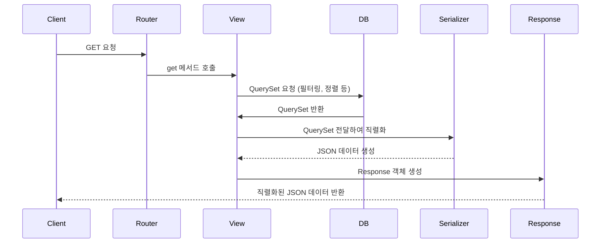
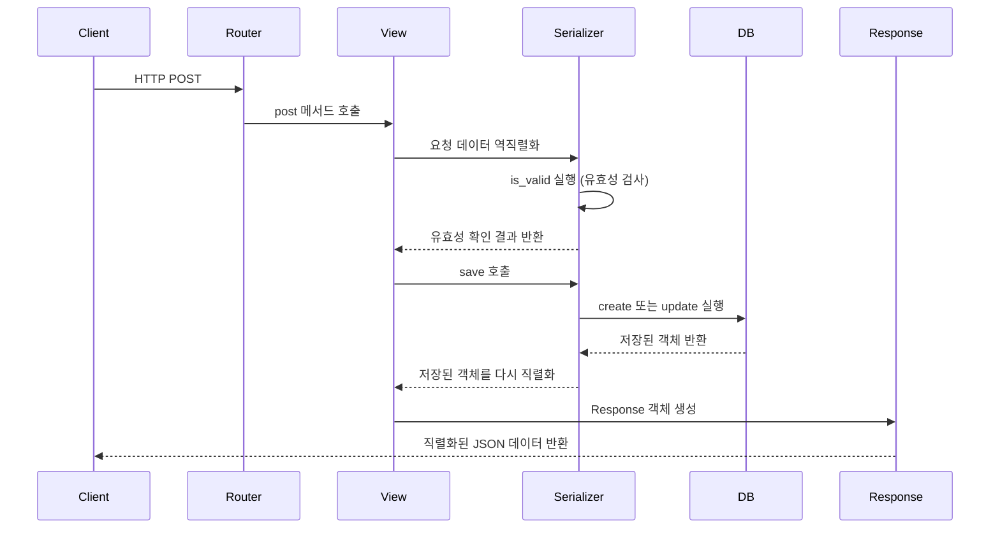

---
description:
aliases: 
tags: 
created: 2023-06-14T10:42:59
updated: 2024-11-26T01:18:13
title: 0014.1.1 drf {django rest framework} 😴
---

# INDEX

- [[0014.1 Django 🎈]]
- [drf page](https://www.django-rest-framework.org/)

# Keywords

- throttles {drf}
- [[internalization with i18n {drf}]]
- [[generic View {drf}]]
	- [[Filtering {drf}]]
- [[APIView {drf}]]
- [[ViewSets and routers {drf}]]
- Serializers
	- ref: [Serializers {doc}](https://www.django-rest-framework.org/api-guide/serializers/)
	- [[Validation {drf}]]
	- [[Serializer 안에 Serializer가 들어가도 되나요?]]
	- [[Reverse Relation {drf}]]
	- [[Serialize queryset result {drf}]]
- [[permissions {drf}]]

# Glossary

- Serialization (직렬화)
	- 복잡한 데이터타입 (쿼리셋, 모델 객체)을 먼저 파이썬 내장 dict로 변환하는 일을 말한다. 이렇게 하는 이유는 dict는 JSON이나 XML과 같은 형식을 준수하기 쉽기 때문이다.
- Deserialization (역직렬화)
	- 반대로, dict로 파싱이 된 JSON이나 XML을 받아 다시 복잡한 데이터타입으로 변환하는 일을 맡는다.
 

# Workflow

- Form 클래스를 만들듯이, Serializer를 상속받은 클래스들은 자기만의 **필드**를 가질 수 있다. 필드를 기반으로 (역)직렬화가 진행이 되며, 기능을 몇가지만 추가하면 view에서는 이 Serializer 메서드를 호출하기만 하면 CRUD가 다 된다.
- **`create`, `update`** 등을 오버라이드하여 Serializer 객체의 상태를 실제 모델에 적용시킬 수 있다. 이름처럼, 새로운 레코드를 추가할 수도 있고, 기존의 인스턴스를 수정할 수도 있다.
- 역직렬화시, **유효성 검사도** 수행할 수 있다. 기본적으로 Form과 비슷한 성격을 많이 띄고 있기 때문에 `is_valid`라는 메서드를 통해 필드에 적격한 데이터가 들어왔는지를 미리 알아낼 수 있다.
	- 유효성 검사는 본질적으로 필드에 대한 검사이다. 따라서 필드에 에러가 발생한 경우, 이를 dict의 형태로 에러 원인을 알려주게 되는데, key에는 필드의 이름이, value에는 구체적인 에러 메시지가 들어오게 된다. 
- Serializer는 다양한 **예외**클래스도 가지고 있다. 예를 들어 `ValidationError`는 발생 시 400 응답을 리턴한다.
- `Serializer.save` 메서드는 `Model.save`와는 전혀 다르다. 객체 인스턴스를 리턴하는 것이지, 모델에 적용하는 명령이 아니라는 것이다. ~~왜 이따위로 만들었지~~ [save, create, update의 차이점 {sof}](https://stackoverflow.com/questions/45100515/what-is-the-different-between-save-create-and-update-in-django-rest-fram)

**GET**

**POST**

## Related Topics

- [[drf_spectacular, OpenAPI specification generator]]
