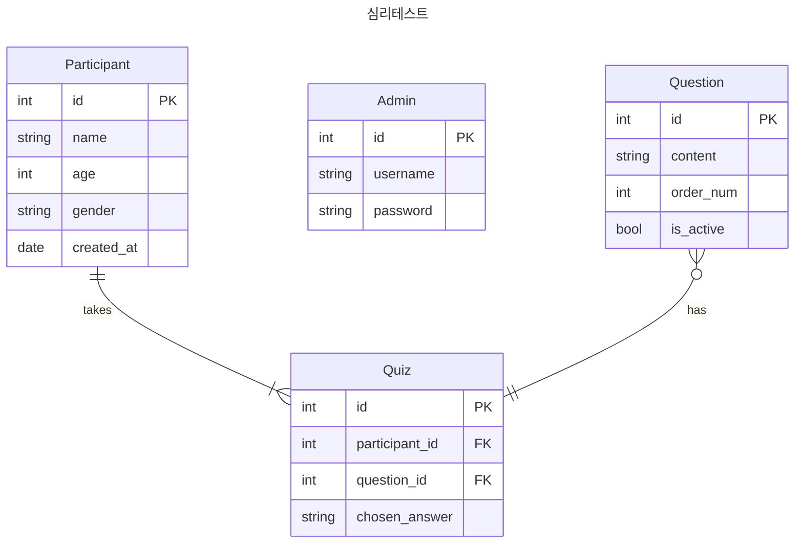

[github.com / ChoiWheatley / psychological_test_completion](https://github.com/ChoiWheatley/psychological_test_completion)

## 파일 구조

```
.
├── app --> 모듈 이름
│   ├── __init__.py ---------> 모듈 엔트리 포인트
│   ├── database.py ---------> db 객체 생성 (SQLAlchemy)
│   ├── models.py -----------> DB 모델 정의부
│   ├── routes.py -----------> 엔드포인트와 핸들러
│   └── templates
│       ├── admin.html
│       ├── dashboard.html
│       ├── index.html
│       ├── manage_questions.html
│       ├── quiz.html
│       ├── quiz_list.html
│       └── results.html
├── entrypoint.sh ------------> ???
├── migrations ---------------> ???
│   ├── README
│   ├── alembic.ini
│   ├── env.py
│   ├── script.py.mako -------> ???
│   └── versions
│       ├── 4323820566e2_.py
│       ├── cf5540f43bf0_add_created_at.py
│       └── fd6b09e0e299_add_order_num_and_is_active_to_question.py
├── nginx.conf
├── pyproject.toml -----------> poetry 의존성
└── run.py
```

## Models



[[SQLAlchemy]]를 제대로 공부하지 않아서 cardinality 관계가 추론이 잘 안된다. `SQLAlchemy.relationship()`은 무엇을 정의하는 걸까?
