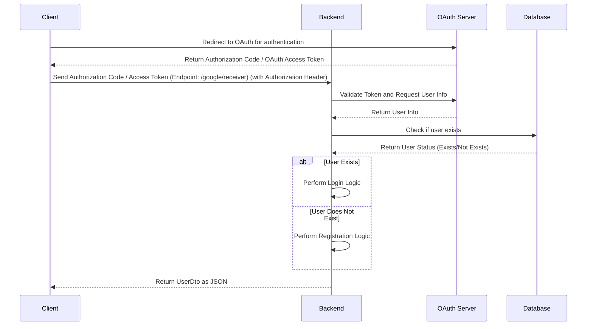

- 소셜 로그인을 redirect + Set-Cookie 없이 할 수 있게 하는 방법을 알아냄.
    - 인가코드 (또는 OAuth 액세스 토큰) 를 클라이언트가 받아서 백엔드 서버에 Authorization 헤더에 담아서 요청. (예시 엔드포인트 `/google/receiver`)
    - 백엔드는 인가코드 (또는 OAuth 액세스 토큰)이 첨부된 클라이언트의 요청을 받아 OAuth 서버에 토큰 검증 및 유저 정보 획득할 수 있음.
    - 유저 정보를 획득한 백엔드는 데이터베이스에 유저 존재 여부를 검사할 수 있고, 유저가 없다면 회원가입을, 있다면 로그인 로직을 수행하면 된다.
    - 마지막으로 백엔드는 리디렉션과 Set-Cookie 없이 JSON으로만 UserDto를 응답해주면 된다. 그 이유는 요청을 보낸 당시 웹 브라우저의 상태는 소셜 로그인이 아닌 서비스 페이지이기 때문이다.

