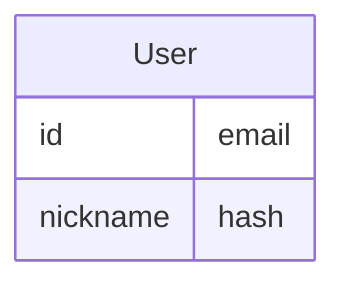

%%  
주니어 백엔드 개발자에게 필요한 기초 지식이랄게 무엇이 존재할까? 

- 장고를 사용한 프로젝트를 진행하며 겪은 다양한 에피소드를 엮어보자.
	- 그래서 장고가 뭘 해주는데
	- 가상환경, 패키지, 프로젝트 시작
	- 장고로 만드는 App, Form, View, Model, Template
- 데이터 모델링
	- 데이터 모델링이니까 개념, 논리 모델링 중점적으로 다루자.
	- 장고 CRUD 코드와 비교 가능?
- REST 기본 개념
	- URI 설계
	- Request & Response
	- DRF
- 인증과 권한 (Authentication & Authorization)
	- OAuth: allauth 활용예시 위주로 + 에러 트래킹
	- JWT
- 보안
	- CSRF
	- SSL/TLS
	- Input Validation
	- CORS: 에러처리 챕터 참조
	- HTTPS
- DevOps: 뭐가 뭔지 대충 아는 식으로
	- ec2
	- s3: S3 에러트래킹
	- rds
	- docker
	- nginx

이게 보니까 순서가 완전 뒤죽박죽이네. 이대로 두고 ==비선형== 방식으로 책을 그때그때 찾아 읽기 위해 작성했다고 의도를 설명하자.

Top Down Approach  
%%

### Before start

- [allbooks {Github Link}](https://github.com/ESTsoft-Book-Project/bookstore)
- [allbooks {Published Link}](http://13.209.22.220)
- [주백개그이 {Notion Book Link}](https://time-pea-17b.notion.site/d976d674ee0f4494bcccf58c695fb2e8?pvs=4)

note:  
저 링크들을 오가면서 발표를 진행할 것임. 라운지에 링크 올리고 발표 시작하자.

---

### 주백개그이?

![[Pasted image 20230720224508.png|200x200]]

note:  
- "주니어 백엔드 개발자, 그 이상으로" 라는 뜻
- 구체적으로 예상독자의 수준을 제목에서부터 함의 → 비전공자 X, 초보자 X

---

### django


+ 장고가 뭘 해주는데
+ Model Template View 
+ [[django app|App]], Form, Routing

---

### Data Modeling


+ 개념, 논리, 물리 모델링 (ER 다이어그램)
+ Django CRUD 예제와 같이 

note:  
CRUD 예제는 ER 다이어그램을 토대로 admin site에 가서 확인해 보는 것이 좋겠다.

---

### REST API

![[Pasted image 20230721023656.png|200]]
+ RESTful한 URI 설계
+ Request & Response
+ DRF 리팩토링한 결과 함께 보기 `users`

note:  
bookstore 깃허브 페이지 가서  DRF
- [users/serializers.py](https://github.com/ESTsoft-Book-Project/bookstore/blob/main/users/serializers.py)
- [users/view.py](https://github.com/ESTsoft-Book-Project/bookstore/blob/main/users/views.py)

---

### Authentication & Authorization

![[Pasted image 20230721023821.png|200]]
+ 인증? 인가?
+ Django의 인증, 인가
+ OAuth: `allauth` 모듈 활용 중심 소셜 로그인
+ JSON Web Token

---

### Securities

![[Pasted image 20230721023921.png|200]]
+ CSRF
+ SSL/TLS
+ Input Validation
+ CORS
+ HTTPS

note:  
이런게 있다 정도만 가볍게

---

### DevOps

![[jeff.jpg|200]]
+ EC2
+ S3
+ RDS
+ Docker
+ Nginx

note:  
척 보면 척 하게 되는 과목이라 그렇게 심각하게 다룰 필요는 없음. 다만 내용이 너무 많으니까

---

# 잠깐! ✋

note:  
책 순서와 발표 순서가 뒤죽박죽이라는 것을 눈치챘을거다. 괜찮다. 이 책은 비선형으로 진행이 되기 때문에 그때그때 찾아가며 읽으면 되는 책으로 만들었다. 따라서 이 책을 완독할 의무또한 없다.

---

<grid drag="10 10" drop="topleft" rotate="-15">
![[Pasted image 20230721235931.png]]
</grid>

# Framework

as a web server

note:
- 장고는 웹 서버이고, 웹 애플리케이션임. 프레임워크로써 이미 설계가 된 대로 장고 백엔드 (서버 백엔드 X)와 통신을 해야함.

---

<grid drag="10 10" drop="topleft" rotate="-15">
![[Pasted image 20230721235931.png]]
</grid>

![[image.png]]  

note:  
장고는 주어진 설계대로 App을 제작하여야 하며, App 별로 MVT 패턴을 적용하여야 함.

---


<grid drag="10 10" drop="topleft" rotate="-15">
![[Pasted image 20230721235931.png]]
</grid>

# MVT

Model, View, Template

note:  
장고 백엔드와의 통신규약.
- Model: DB관리, ORM 기능 지원
- View: 비즈니스 로직 구현, MVC 패턴의 View와 Controller를 모두 View가 담당함.
- Template: HTML + Django Template Backend => 동적으로 HTML 생성

---

<grid drag="10 10" drop="topleft" rotate="-15">
![[Pasted image 20230721235931.png]]
</grid>

## Application

<grid drag="10 10" drop="topleft" rotate="-15">
![[Pasted image 20230721235931.png]]
</grid>

- `models.py`
- `views.py`
- `urls.py`
- ...

note:
- MTV 패턴을 구현하는 하나의 단위인 APP, 장고는 다음과 같은 파일로 구성되어 있다.


---

<grid drag="10 10" drop="topleft" rotate="-15">
![[Pasted image 20230721235931.png]]
</grid>

```python
class SignupForm(UserCreationForm):
    class Meta:
        model = User
        fields = ["email", "nickname", "password1", "password2"]
```

note:
- 백엔드 개발자가 프론트도 겸해야 할 때 쓰는 Form, 

---

<grid drag="10 10" drop="topleft" rotate="-15">
![[Pasted image 20230721235931.png]]
</grid>


![[routing.png]]  

note:  
RESTful한 리소스 구분을 위한 Routing.

`urlpatterns`가 라우팅을 수행함. 프로젝트에도 있고, 각 앱에도 있어서 들어오는 요청에 따라 구체적인 App의 `urlpatterns`에게 요청을 전달하는 일종의 ==게이트웨이==와 같은 기능을 하고 있음을 보여준다.

라우팅이 성공적으로 진행되면 view에서 로직을 처리하고 웹에 응답을 보낸다.

---

<grid drag="10 10" drop="topleft" rotate="-15">
![[Pasted image 20230721235931.png]]
</grid>

```
GET http://13.209.22.220/products/book/
```

`core/urls.py`

```python
urlpatterns = [
    path("products/", include("products.urls")),
]
```

---

<grid drag="10 10" drop="topleft" rotate="-15">
![[Pasted image 20230721235931.png]]
</grid>

```
GET http://13.209.22.220/products/book/
```

`products/urls.py`

```python
urlpatterns = [
    path('book/', book_list, name='book_list'),
]
```

---

<grid drag="10 10" drop="topleft" rotate="-15">
![[Pasted image 20230721235931.png]]
</grid>

```
GET http://13.209.22.220/products/book/
```

`proejcts/views.py`

```python
def book_list(request):
    books = Product.objects.all()
    for book in books:
        url = str(book.image)
        url_without_query = url.split('?')[0]
        book.image = url_without_query
    return render(request, 'book_list.html', {'books': books})
```

---

<grid drag="10 10" drop="topleft" rotate="15">
![[db.png]]
</grid>

# Database

## Relational Database

### Data Modeling <!-- element class="fragment highlight-red" -->

Entity Relationships

note:  
Data Modeling 챕터는 바로 들어가기에 앞서 이 개념의 위치 파악에 힘을 써야 한다. 데이터베이스는 사실 윈도우 파일 시스템도 데이터베이스라고 불리울 수 있을 정도로 일반적인 개념.

Relational database(RDB)는 Key와 Value의 관계를 테이블화한 데이터베이스

Key 덕분에 서로 연관성 있는 테이블을 연결할 수 있게 되는데, 여기에서 ==데이터 모델링==이 튀어나오는 것.

데이터 모델링에는 개념 / 논리 / 물리 모델링이 있는데, 우리가 흔히 "DB 다이어그램"이라고 부르는 단계는 개념 + 논리 모델링을 아우른다. 우리는 이 단계에만 집중한다.

---

<grid drag="10 10" drop="topleft" rotate="15">
![[db.png]]
</grid>

# Entity



note:  
엔티티는 **고유**하게 식별할 수 있고 독립적으로 존재 가능한 개체이다. 

---

<grid drag="10 10" drop="topleft" rotate="15">
![[db.png]]
</grid>

# Attribute

---

<grid drag="10 10" drop="topleft" rotate="15">
![[db.png]]
</grid>

# Relationship

---

<grid drag="10 10" drop="topleft" rotate="15">
![[db.png]]
</grid>

### Django Models

`products/models.py`

---

<grid drag="10 10" drop="topleft" rotate="-15">
REST
</grid>

# RESTful?

note:  
REST는 웹을 망가뜨리지 않으면서 설계를 변경하기 위해 고안된 규약. HTML 문서, 엔티티 등의 리소스를 접근하기 위해 계층적인 경로를 가짐. 

메서드(동사)를 통해 리소스 명시와 이에 따른 동작을 분리할 수 있게 됐다. 덕분에 쌩판 처음 보는 요청을 접해도 직관적으로 유추할 수 있게 되었다.

---

<grid drag="10 10" drop="topleft" rotate="15">
REST
</grid>

`GET /books`

---

<grid drag="10 10" drop="topleft" rotate="15">
REST
</grid>

`POST /books`

---

<grid drag="10 10" drop="topleft" rotate="15">
REST
</grid>

`/deleteBooks`

note:  
책을 추가하는 동작(동사)가 URI에 정의

---

<grid drag="10 10" drop="topleft" rotate="15">
REST
</grid>

`/books/getAllBooks`

note:  
book 이라는 단어 중복사용

---

<grid drag="10 10" drop="topleft" rotate="15">
REST
</grid>

### Request & Response

note:  
ch.10 요청과 응답 참고바람.

REST는 웹과 함께 성장했기에, HTTP는 REST이다. 

---

<grid drag="10 10" drop="topleft" rotate="15">
REST
</grid>

```http
GET /books HTTP/1.1
Host: example.org
```

note:  
우리가 눈여겨 볼 것은 바로 헤더와 바디. 일단 헤더 먼저 보자.
