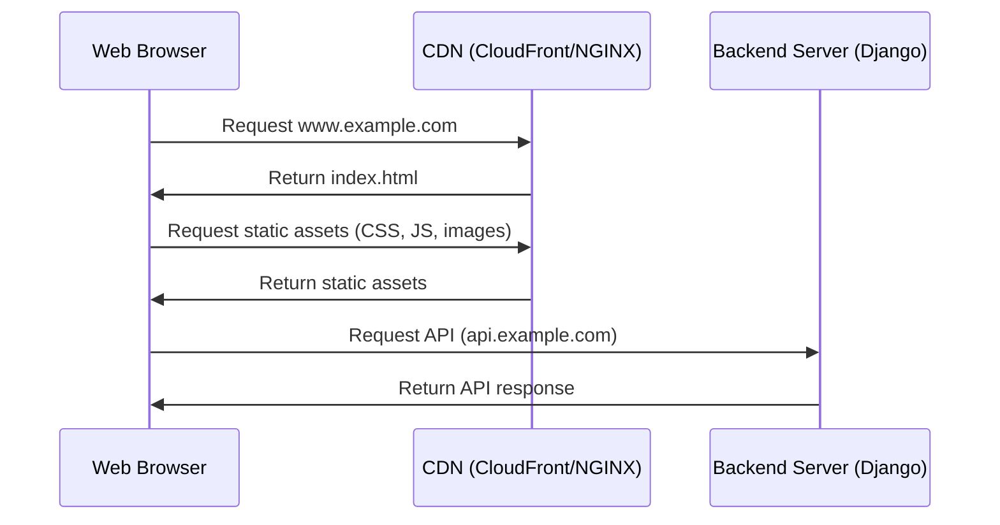

1.	유저가 웹 브라우저에서 <www.example.com>에 접근합니다.
2.	웹 브라우저가 <www.example.com>을 CDN (CloudFront 또는 NGINX)에 요청합니다.
3.	CDN이 index.html 파일을 웹 브라우저에 반환합니다.
4.	웹 브라우저가 정적 자산 (CSS, JS, 이미지)을 CDN에 요청합니다.
5.	CDN이 정적 자산을 웹 브라우저에 반환합니다.
6.	웹 브라우저가 API 요청을 백엔드 서버 (api.example.com)에 보냅니다.
7.	백엔드 서버가 API 응답을 웹 브라우저에 반환합니다.

